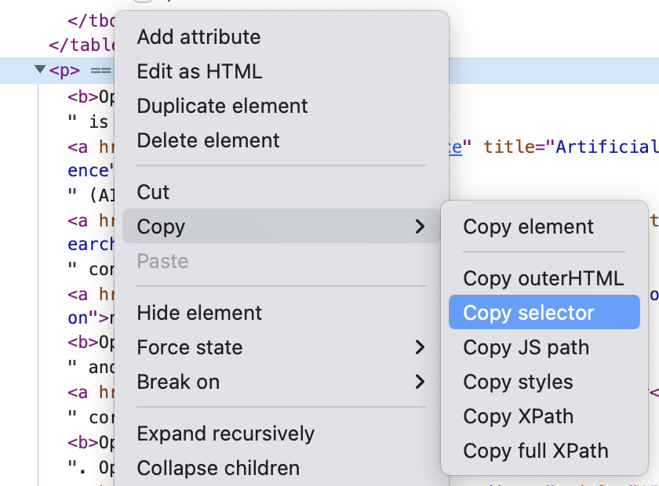
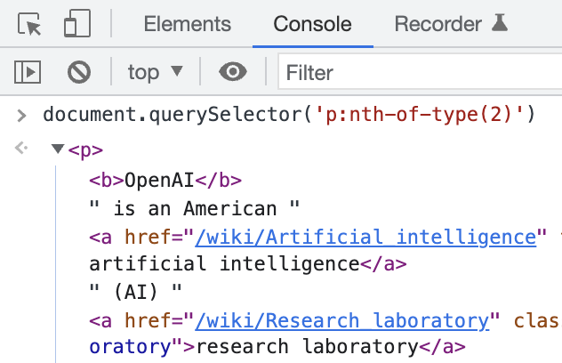

You can use vals to web scrape websites.

Either by fetching HTML and using a parsing library, or by making an API call to an external service that runs a headless browser for you.

## Locate the HTML element that contains the data you need

Right click on the section of a website that contains the data you want to fetch and then inspect the element. In Chrome, the option is called **Inspect** and it highlights the HTML element in the Chrome DevTools panel.

For example, to scrape the introduction paragraph of the [OpenAI](https://en.wikipedia.org/wiki/OpenAI) page on Wikipedia, inspect the first word of the first paragraph.

In the **Elements** tab, look for the the data you need and right click the parent element and choose **Copy selector** to get the [CSS selector](https://developer.mozilla.org/en-US/docs/Web/CSS/CSS_Selectors): `#mw-content-text > div.mw-parser-output > p:nth-child(7)`.

If you know a little CSS, it’s better to write your own selector by hand to make it more generic. This can make the selector less vulnerable to the website being updated and, e.g., class names changing. In this case, you can use `p:nth-of-type(2)`.

Optionally, use `document.querySelector` in the **Console** to check your CSS selector is correct.

## Parsing HTML

The [OpenAI](https://en.wikipedia.org/wiki/OpenAI) page on Wikipedia is rendered on the server and arrives as a complete HTML document. This makes it a good fit for [cheerio](https://www.val.town/examples/packages/cheerio) which parses HTML markup and provides an API for traversing/manipulating the resulting data structure. We also recommend [node-html-parser](https://www.val.town/examples/packages/node-html-parser) and [linkedom](https://www.val.town/search?q=linkedom).

  <iframe src="https://www.val.town/embed/vtdocs.webscrapeWikipediaIntro" width="100%" frameborder="no" style="height: 400px;">
    &#x20;
  </iframe>

