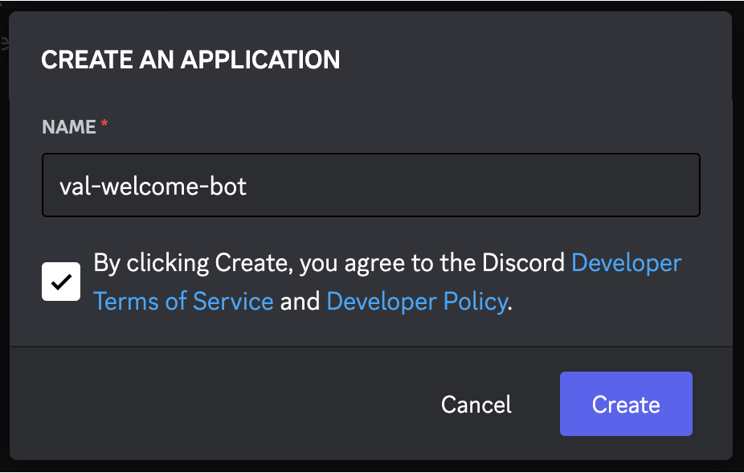
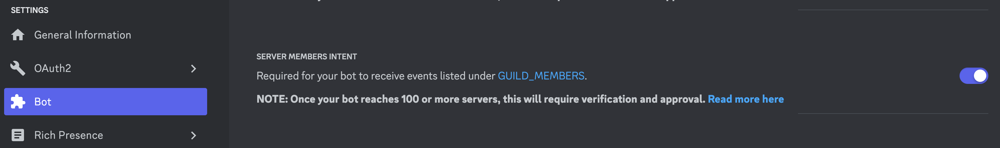
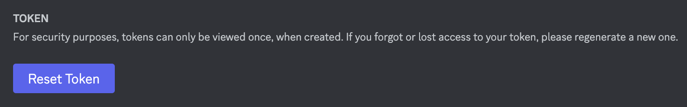
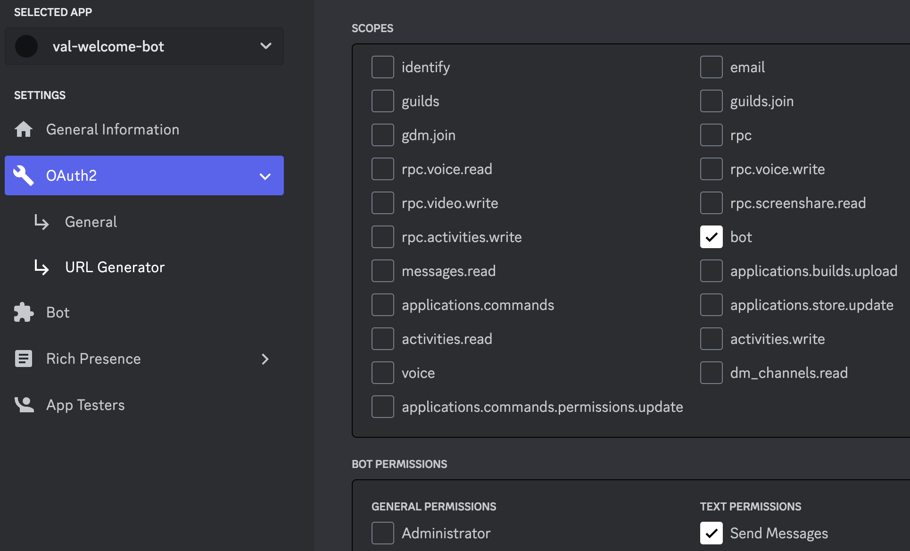
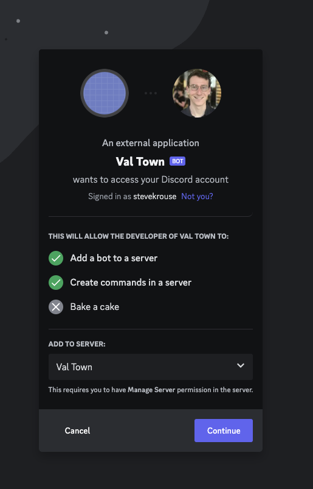

You can create a Discord welcome bot using scheduled vals.

In this example, a scheduled val gets the most recent members for your server
and sends a DM to new users from a bot that you'll create. It avoids messaging
users who joined the server before the bot was added.

When users reply to the bot, the message is forwarded as a DM.

## Create a new Discord application

Visit
[https://discord.com/developers/applications](https://discord.com/developers/applications):



## Enable the server members intent

Since the bot will be requesting a list of guild members, you need to enable the
**SERVER MEMBERS INTENT** on the **Bot** tab.



## Get your bot's token

On the **Bot** tab, copy the **TOKEN**, and save it as a [Val Town environment variable](https://www.val.town/settings/environment-variables) as
`discordBot`.



## Create a link via the URL Generator

On the **OAuth2** tab, under **URL Generator,** select the **bot** scope, and
give it permission to **Send Messages**, and then copy the **GENERATED URL** at
the bottom of the page.



## Click on the generated link

Choose the server you want to invite the bot to and press **Continue**.



## Get your Server ID

Save your server id as a [Val Town environment variable](https://www.val.town/settings/environment-variables) as `discordServerId`. (See:
[Where can I find my User/Server/Message ID?](https://support.discord.com/hc/en-us/articles/206346498-Where-can-I-find-my-User-Server-Message-ID-))

## Setup your welcome message scheduled val

Remix this scheduled val that will send a welcome message to new users.

[View and run this example on Val Town](https://www.val.town/v/vtdocs/discordWelcomeBotCron)

```ts
import { set } from "https://esm.town/v/std/set?v=11";
import { discordGetMembers } from "https://esm.town/v/vtdocs/discordGetMembers";
import { discordSendDM } from "https://esm.town/v/vtdocs/discordSendDM";
import process from "node:process";
let { discordDMs } = await import("https://esm.town/v/vtdocs/discordDMs");
let { discordWelcomedMembers } = await import("https://esm.town/v/vtdocs/discordWelcomedMembers");
let { discordWelcomeBotStartedAt } = await import("https://esm.town/v/vtdocs/discordWelcomeBotStartedAt");

export const discordWelcomeBotCron = async () => {
  // Only target new users going forwards from bot creation
  if (discordWelcomeBotStartedAt === undefined) {
    discordWelcomeBotStartedAt = Date.now();
  }
  // Don't message a user more than once
  if (discordWelcomedMembers === undefined) {
    discordWelcomedMembers = [];
  }
  // Store channels we've sent a DM to
  // in case we want to forward replies to the bot
  if (discordDMs === undefined) {
    discordDMs = [];
  }
  const members = await discordGetMembers(
    process.env.discordBot,
    process.env.discordServerId,
  );
  await Promise.all(members.map(async (member) => {
    const existingMember = (new Date(member.joined_at)).getTime()
      < discordWelcomeBotStartedAt;
    const alreadyWelcomed = discordWelcomedMembers.includes(
      member.user.id,
    );
    if (existingMember || alreadyWelcomed) {
      return;
    }
    const DMid = await discordSendDM(
      process.env.discordBot,
      member.user.id,
      "👋 Welcome!",
    );
    console.log(`Sent a message to ${member.user.id}`);
    // Store that we have messaged this user
    discordWelcomedMembers.push(member.user.id);
    if (DMid !== undefined)
      discordDMs.push(DMid);
  }));
  await Promise.all([
    set(
      "discordWelcomeBotStartedAt",
      discordWelcomeBotStartedAt,
    ),
    set("discordDMs", discordDMs),
    set(
      "discordWelcomedMembers",
      discordWelcomedMembers,
    ),
  ]);
};
```

This val stores state in three other vals.

- `@me.discordWelcomeBotStartedAt` stores the timestamp of the bot's creation so
  that everyone who's already on the server doesn't get a welcome message when
  the bot is added.
- `@me.discordWelcomedMembers` stores the ids of everyone that has been messaged
  so that they don't receive another message.
- `@me.discordDMs` stores the channel ids (each time the bot DMs a user it
  creates a channel) so that we can check for replies to the bot.

These vals will be automatically created if they don't already exist.

## Get your User ID

Save your user id as a [Val Town environment variable](https://www.val.town/settings/environment-variables) as `discordUserId`. (See:
[Where can I find my User/Server/Message ID?](https://support.discord.com/hc/en-us/articles/206346498-Where-can-I-find-my-User-Server-Message-ID-))

This is so the bot knows where to forward user replies.

## Set up your message forwarder scheduled val

Remix this scheduled val that will forward user replies to your Discord user.

[View and run this example on Val Town](https://www.val.town/v/vtdocs/discordWelcomeBotMsgForwarder)

```ts
import { discordSendDM } from "https://esm.town/v/vtdocs/discordSendDM";
import process from "node:process";
import { discordFetch } from "https://esm.town/v/vtdocs/discordFetch";
import { discordDMs } from "https://esm.town/v/vtdocs/discordDMs";

export const discordWelcomeBotMsgForwarder = async ({ lastRunAt }: Interval) => {
  if (discordDMs === undefined) {
    throw `expected @me.discordDMs to be a string[] of channel ids`;
  }
  const repliesToBot = [];
  for (const channelId of discordDMs) {
    const messages = await discordFetch(
      process.env.discordBot,
      // Note: not using pagination here
      // (we assume < 50 replies to the bot per each DM)
      `/channels/${channelId}/messages?limit=50`,
    );
    repliesToBot.push(
      ...messages
        // Ignore the welcome message
        .filter((message) => message?.author?.bot !== true)
        // Only forward new messages
        .filter((message) => lastRunAt < new Date(message.timestamp))
        // A little formatting
        .map((message) =>
          `${message.author.username}#${message.author.discriminator}: ${message.content}`
        ),
    );
  }
  if (repliesToBot.length !== 0) {
    await discordSendDM(
      process.env.discordBot,
      process.env.discordUserId,
      repliesToBot.join("\n"),
    );
  }
};
```

This val loops through all of the DMs between the bot and new users. It checks
for any new replies and then forwards these messages as a new DM (from the bot,
to your Discord user).
