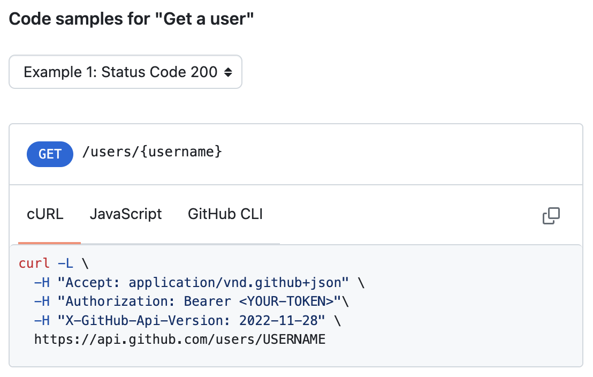

For example, we can get a user without passing an authentication token.



GitHub API endpoints have a cURL command that you can manually translate into a `fetchJSON` call (e.g. see [Get a user](https://docs.github.com/en/rest/users/users?apiVersion=2022-11-28#get-a-user)).

Here's a Val that returns a GitHub user object for a given username:

```ts title="@vtdocs/getGithubUser" val
import { fetchJSON } from "https://esm.town/v/stevekrouse/fetchJSON?v=41";

export const getGithubUser = async (username: string) => {
  const user = await fetchJSON(
    `https://api.github.com/users/${username}`,
  );
  return user;
};
```

You can alter it, or just call it directly like this:

```ts title="Usage of @vtdocs/getGithubUser" val
import { getGithubUser } from "https://esm.town/v/vtdocs/getGithubUser";

console.log(await getGithubUser("stevekrouse"));
```

You can also do this with [octokit.js](https://github.com/octokit/octokit.js). Reminder: import npm packages by prepending the package name with `npm:`.

```ts title="Usage of npm:@octokit/core" val
import { Octokit } from "npm:@octokit/core";

export const getGithubUserViaOctokit = async (username: string) => {
  const octokit = new Octokit();
  const user = await octokit.request("GET /users/{username}", {
    username,
    headers: {
      "X-GitHub-Api-Version": "2022-11-28",
    },
  });
  return user;
};
```
