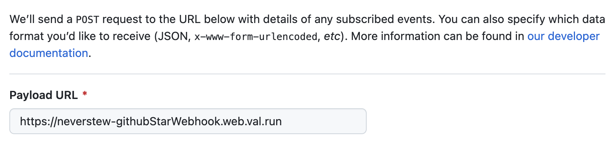
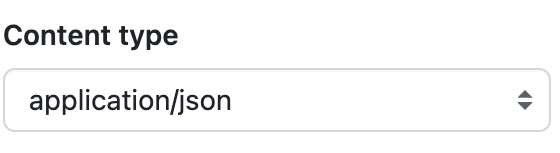
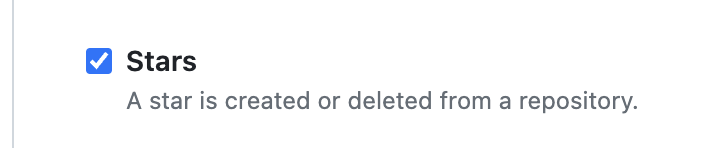
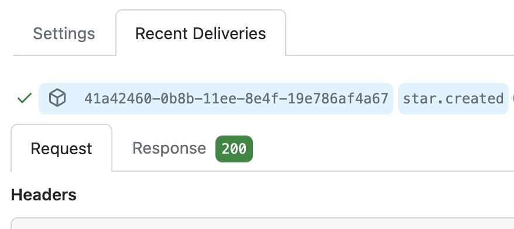
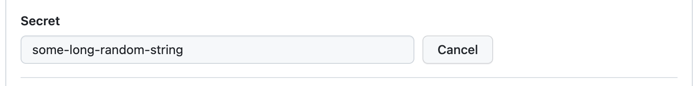

import Val from "@components/Val.astro";

GitHub supports sending webhooks for a
[number of events](https://docs.github.com/en/webhooks-and-events/webhooks/webhook-events-and-payloads).
In this example, you'll use [@std/email](/reference/std/email/) to send yourself an email when someone
stars your GitHub repository, but you could also send a notification to
[Slack](/guides/slack/send-messages-to-slack/),
[Discord](/guides/discord/send-message/), or anywhere else.

First, create an HTTP trigger within a val to receive star webhooks from
GitHub, or use this one:

<Val url="https://www.val.town/embed/maxm/githubStarWebhookExample" />

Go to the **Webhooks** tab in your GitHub repository's settings.

Get your val's web endpoint URL (via the menu) and paste it in the **Payload
URL.**

Be sure to set the content type to `application/json` so that it's super easy
for us to extract the data out of it.

You can filter for the specific events you want to receive, or opt to choose
everything.

To just star events, toggle the checkbox inside _Let me select individual
events._

When your GitHub repository is starred, GitHub will sends a webhook payload,
which is handled by your val, and you get an email!

You can debug this on the GitHub side by looking at the Recent Deliveries page
of your webhook.

## Securing GitHub Webhooks

Once public, your val function will listen for any payload sent to its endpoint.
For security reasons, you probably want to limit requests to those coming from
GitHub. One method is to add a secret token and perform validation.

Edit your existing webhook on GitHub and in the **Secret** field, add a random
string with high entropy. Add this to your
[environment variables](/reference/environment-variables/) on Val Town as `githubWebhookToken`.

GitHub uses this secret to create a hash signature with each payload. This hash
signature is sent as a header: `x-hub-signature-256`.

With your secret, the payload, and the signature header, you can use Octokit's
[verify](https://github.com/octokit/webhooks.js/#webhooksverify) function to
confirm that the webhook came from GitHub. Here's how you would integrate that into the original example:

<Val url="https://www.val.town/embed/maxm/verifiedGithubStarWebhookExample" />

With your webhook pointing to the new example, your val now refuses payload that
don't come from GitHub!

If you want more details, GitHub has an in-depth guide on
[securing webhooks](https://docs.github.com/en/webhooks-and-events/webhooks/securing-your-webhooks).
