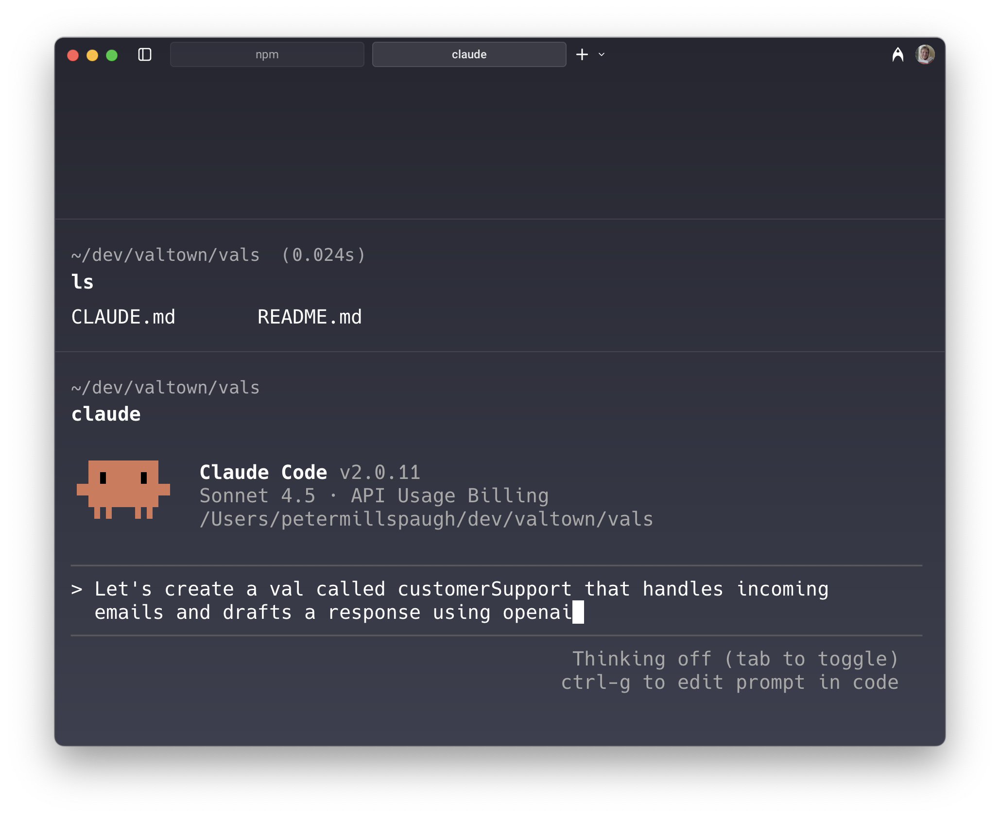

## Instructions

1. Install the [Val Town CLI](https://github.com/val-town/vt) and log in
2. Install [Claude Code](https://docs.claude.com/en/docs/claude-code/quickstart) and log in
3. Copy-paste our [system prompt](https://www.val.town/x/valdottown/Townie/code/prompts/system_prompt.txt) into [`CLAUDE.md`](https://docs.claude.com/en/docs/claude-code/memory) at the root of your local val directory
4. Copy-paste our [vt readme](https://github.com/val-town/vt/blob/main/README.md) into `README.md` at the root of your local val directory

## Example

Using the Val Town CLI and Claude Code, we can create a customer support val that receives incoming emails and sends you a draft response using an LLM.

