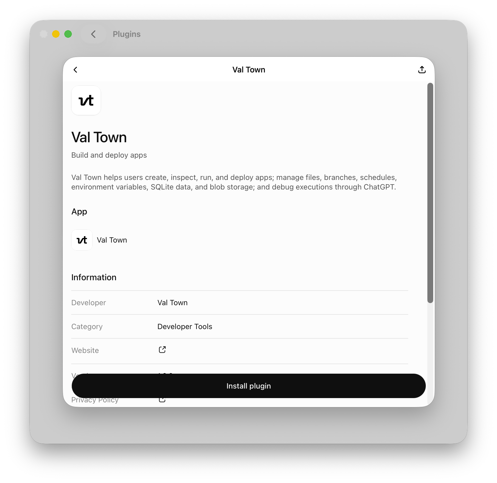

You can work with Val Town in ChatGPT (web, desktop, mobile) using our plugin from OpenAI's marketplace. Just open ChatGPT and search for “Val Town” in plugins, then authenticate with your Val Town account. For example, on desktop, go to Settings > Plugins > Browse plugins > Search for “Val Town” > Install plugin.

