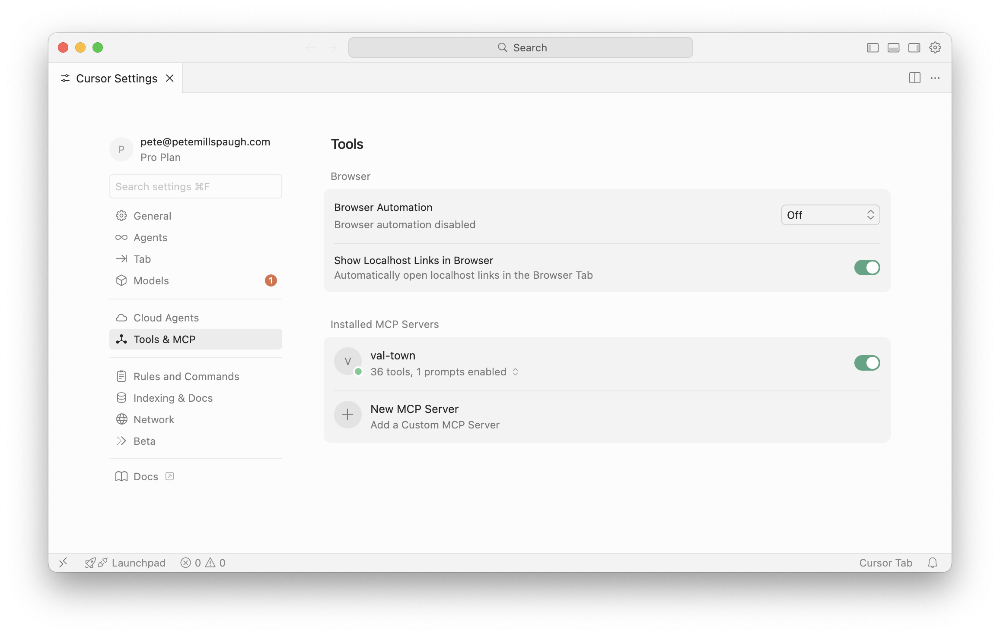

Work with Val Town in Cursor using our [MCP](#mcp) server or [CLI](#cli). You can ask Cursor to:

- List or examine your vals and read your sqlite data, logs, and almost any of your Val Town data
- Edit your vals and even agentically iterate, viewing the output and logs until it's done

## MCP



1. Go to Cursor Settings > Tools & MCP > New MCP Server (or "Add Custom MCP")
2. Create an API token in the [Val Town console](https://www.val.town/settings/api)
3. Add the following to `mcp.json`, replacing `API_TOKEN_HERE`:
   ```
   {
     "mcpServers": {
       "val-town": {
         "url": "https://api.val.town/v3/mcp",
         "headers": {
           "Authorization": "Bearer API_TOKEN_HERE"
         }
       }
     }
   }
   ```

## CLI

You can edit vals locally with Cursor and the Val Town CLI. The recommended workflow uses `vt watch`, which will automatically sync your changes to Val Town as you save files.

1. Open [Cursor](https://cursor.com)
2. Install the [Val Town CLI](https://github.com/val-town/vt)

```
deno install -grAf jsr:@valtown/vt
```

3. `vt create`, `vt remix`, or `vt clone` a val. Select "Yes" to add editor files\*
4. `cd` into your val's directory
5. `vt checkout -b <branch>` to isolate changes (optional)
6. `vt watch` to sync with Val Town

_\* Running `vt create|remix|clone` will prompt you to add editor files, including `AGENTS.md` with our [system prompt](https://val.town/townie/system-prompt), which Cursor should recognize._
