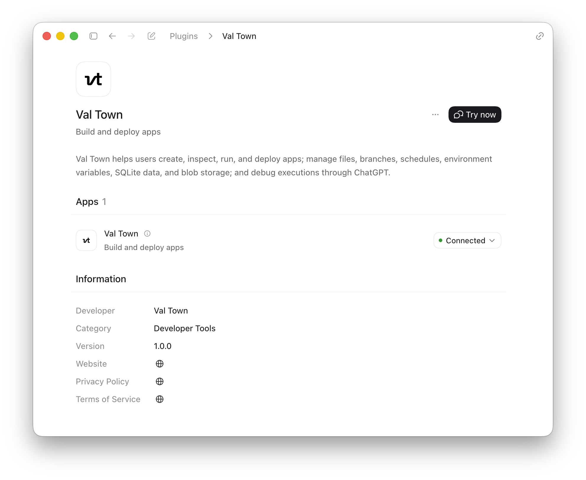

The easiest way to work with Val Town in Codex is to install the Val Town plugin. In Codex, go to Plugins > Search for "Val Town" > Install plugin. Then log in with your Val Town account.

Codex can list projects and files, read and write code, and read your sqlite data, blob storage, logs, and almost any of your Val Town data. You can schedule cron jobs, set environment variables, and more—pretty much anything you can do in the Val Town web app. Codex can also work with our [MCP server](/guides/prompting/mcp) and [CLI](/guides/prompting/cli), but the plugin is the recommended path.

