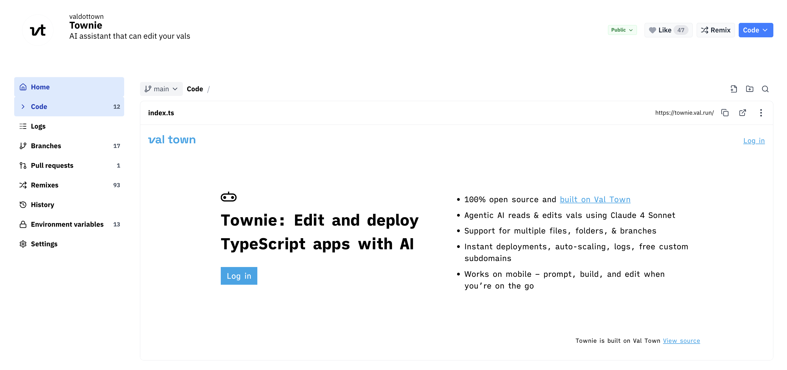

Townie is Val Town's coding agent that can read, edit, and run your vals alongside you in the Val Town editor.

Powered by the Claude 4.5 family and our [MCP server](/guides/prompting/mcp). Available on all Val Town plans. Click the little robot in the bottom right corner on [val.town](https://val.town) to get started.

## Features

- **Safe code changes:** approve/deny edits, isolate via [branching](/vals/branches), inspect/rollback with version history
- **Tight feedback loops:** see and test code changes immediately with 100ms deploys and realtime logs
- **Val Town knowledge base:** leverage Val Town features like sqlite, blob, crons, email, etc.
- **History:** view your chat history and continue old chats
- **Modes:** choose between Normal, Plan, or Allow All (aka YOLO)
- **Models:** choose between Claude 4.5 Opus, Sonnet, or Haiku

## Pricing

Townie is available on Val Town [Teams](https://www.val.town/teams) and [Pro](https://www.val.town/pricing) plans, with a cap.

| 🟩 Teams    | 🟨 Pro    | 🟥 Free       |
| ----------- | --------- | ------------- |
| $100/mo cap | $5/mo cap | Not available |

## Learn more

- The Townie [system prompt](https://www.val.town/x/valdottown/Townie/code/prompts/system_prompt.txt) is public if you are curious to peak under the hood
- Townie is currently on v5. We wrote up learnings from prior versions on our blog: [What we learned copying all the best code assistants](https://blog.val.town/blog/fast-follow)
