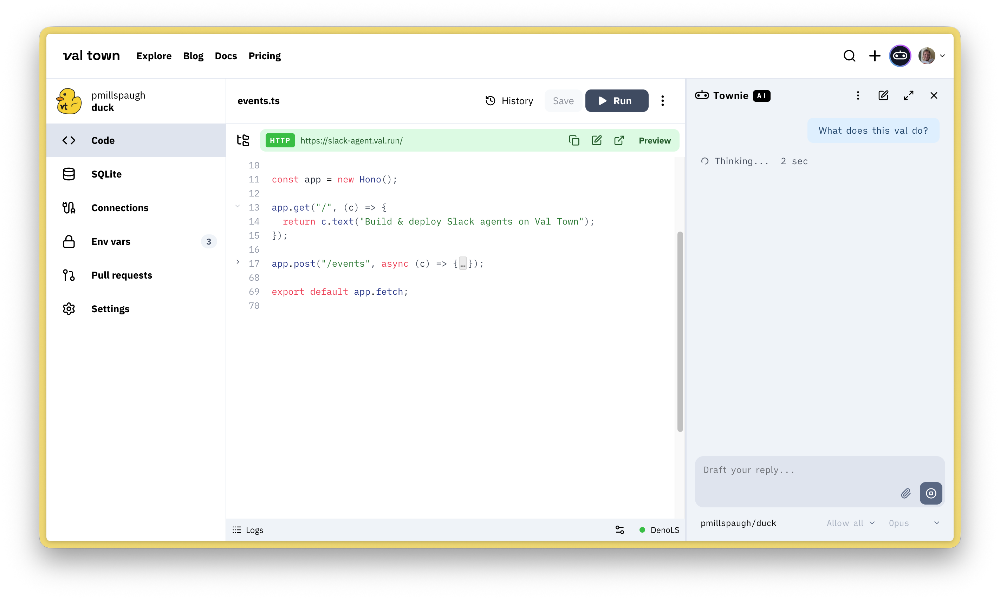

[Townie](https://val.town/townie) is Val Town's in-browser coding agent. Pretty much anything you can do in the Val Town UI, Townie can do: read, write, and run code; read SQLite, blob storage, logs, and environment variables; schedule crons; view version history, create branches; and more.

Powered by the Claude family and the Val Town [MCP server](/guides/prompting/mcp). Available on Pro and Teams plans. Click the little robot in the top right corner on [val.town](https://val.town) to get started.

## Features

### Models

We're using the following Anthropic models.

1. **Opus 4.8**
2. **Sonnet 4.6**
3. **Haiku 4.5**

### Modes

1. **Normal**: Townie asks you to approve before writes
2. **Plan**: Townie as your read-only thinking partner
3. **Allow all edits**: Townie YOLOs changes to your vals

### Tools

Townie has full access to our [MCP server](/guides/prompting/mcp), so it can do almost anything you as a user can do.

- List, search, & create vals
- Read, write, & run files
- Fetch a val's HTTP endpoint
- View history, create & switch branches, revert versions
- Query your SQLite databases & Blob storage
- Read & write environment variables
- Read logs
- Read logs (e.g. to debug)
- Read & configure cron jobs
- Remix vals
- List orgs
- ...

### System prompt

Our [system prompt](https://val.town/townie/system-prompt) is public. It provides Townie full context on how to use the Val Town platform—e.g. available [tools](#tools), the Val Town [runtime](/reference/runtime/), our standard library, different types of vals, etc.

### Context

Townie automatically attaches the val you're currently viewing as context. You can manually edit what vals are in context by selecting that menu in the chat bar.

### Keyboard shortcuts & slash commands

You can open Townie with `⌘J`. The following slash commands are available:

- `/cost` Show estimated cost and usage
- `/context` Show context window usage
- `/compact` Summarize older messages to save context
- `/clear` Start a new chat

### History & version control

You can view your Townie [chat history in settings](https://www.val.town/settings/chat-history) to read and continue old chats.

As when coding without AI, you can use Val Town's [versioning and collaboration](https://docs.val.town/vals/#versioning--collaboration) tools like branching, remixing, PRs, and version history to safely work with Townie.

## Pricing

Townie is available on Val Town [Teams](https://www.val.town/teams) and [Pro](https://www.val.town/pricing) plans with $100 and $5 monthly usage included, respectively.

| 🟩 Teams    | 🟨 Pro     | 🟥 Free       |
| ----------- | ---------- | ------------- |
| $100/mo cap | $10/mo cap | Not available |

## Learn more

Townie has been through many iterations, which we [wrote about](https://blog.val.town/townie-v5) on our blog. We also documented learnings from prior versions in: [What we learned copying all the best code assistants](https://blog.val.town/blog/fast-follow)
