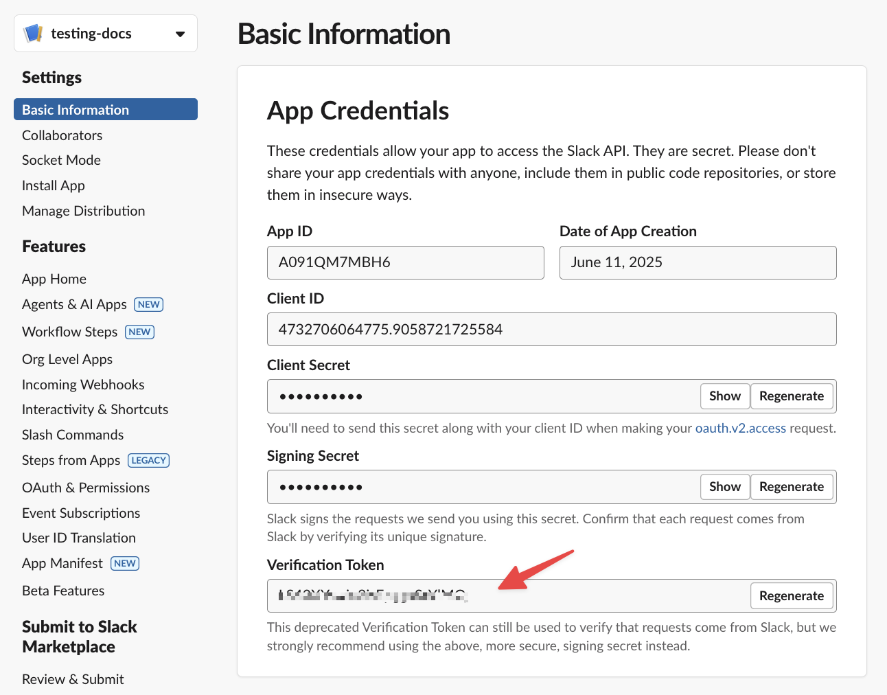
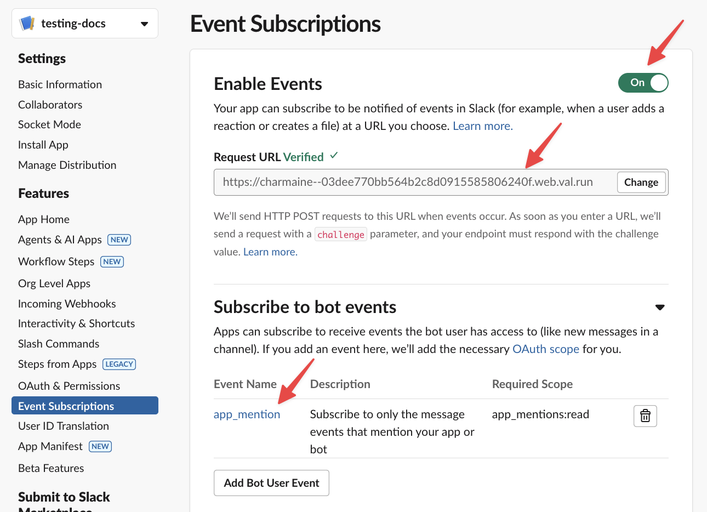
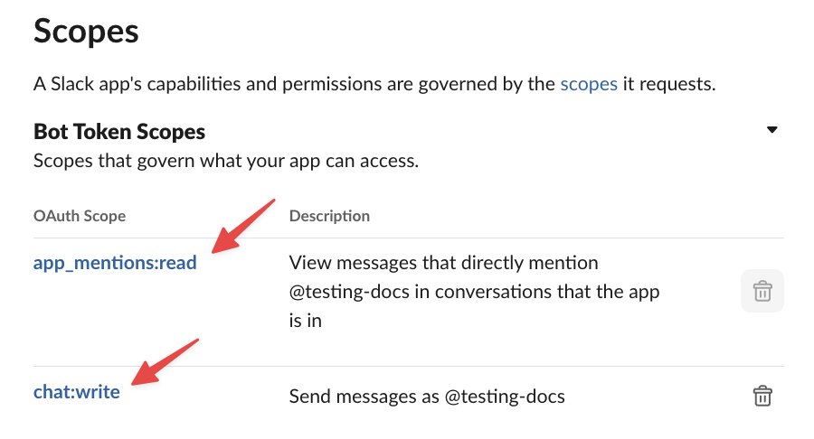
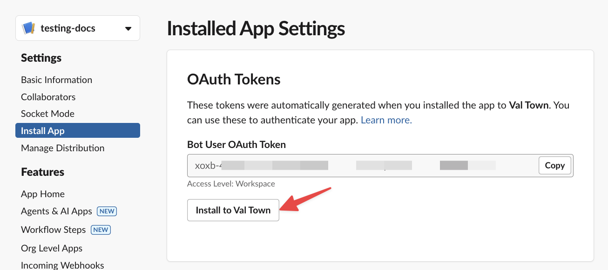
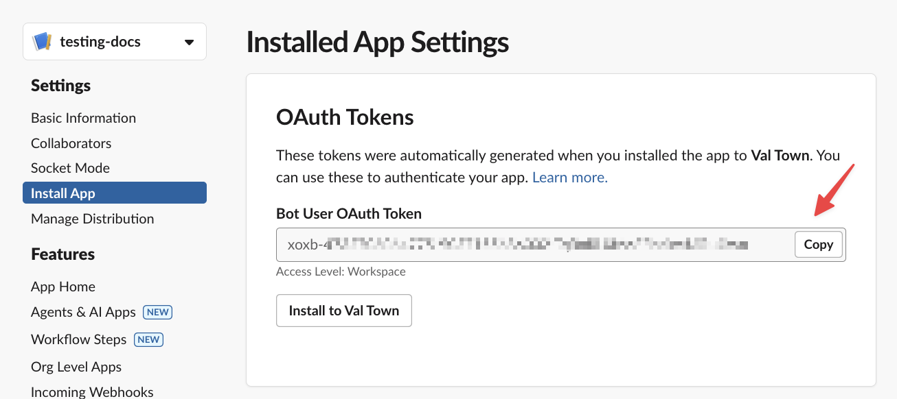
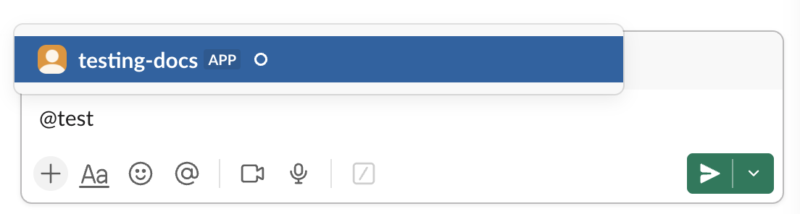
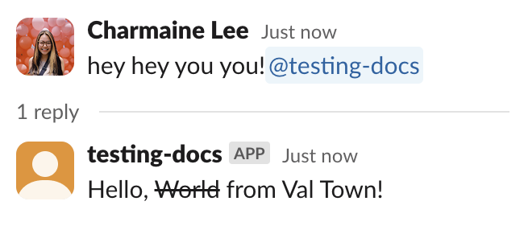

import Val from "@components/Val.astro";

_Time to complete: 10 minutes_

This guide walks you through building a Slack bot that responds to mentions in channels.

If you just want to send simple Slack messages without interactivity, check out our [Slack webhook guide](/guides/slack/send-messages-to-slack/). And if you want an AI agent Slack bot, see our [Slack agent guide](/guides/slack/agent/).

## Step 1: Remix the bot template

1. [Remix this val](https://www.val.town/x/charmaine/slackBotExample/code/main.tsx) to get started:

<Val url="https://www.val.town/embed/x/charmaine/slackBotExample/main.tsx" />

2. Copy the HTTP endpoint URL (via the ... menu for `main.tsx`) - this is where Slack will send events to your Val Town bot.

## Step 2: Create a Slack app

1. Go to [Slack API](https://api.slack.com/apps?new_app=1) and create a new app **From Scratch**
2. Name your app and select your workspace

## Step 3: Add environment variables

In your val's sidebar, add these **Environment Variables**:

- **slackVerificationToken**: From **Settings → Basic Information → Verification Token**
- **slackToken**: Leave empty (you'll fill this after installing)

## Step 4: Set up events

1. Go to **Features → Event Subscriptions**
2. Enable events and paste your val's HTTP endpoint in **Request URL**
3. Subscribe to **app_mention** under **Subscribe to bot events**

## Step 5: Set bot permissions

In **OAuth & Permissions → Scopes**, add:

- `app_mentions:read` (should already be there)
- `chat:write`

## Step 6: Install your app

Go to **Settings → Install App** and install to your workspace.

## Step 7: Add OAuth token

1. Copy the **Bot User OAuth Token** from **OAuth & Permissions**
2. Update your val's **slackToken** environment variable

## Step 8: Test your bot

1. Invite the bot to a channel
   
2. Mention the bot - it will reply!
   

## What's next?

You can find more Slack examples on our [Templates page](https://www.val.town/explore/use-cases).
