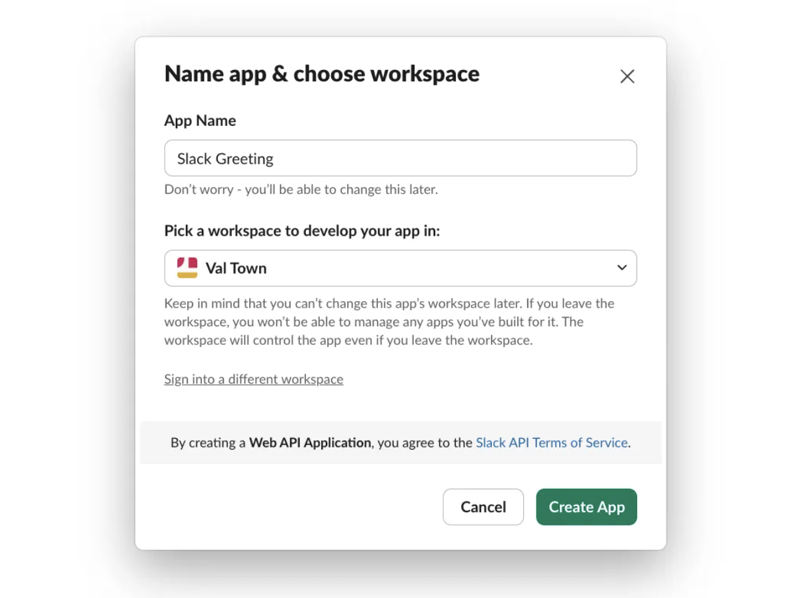
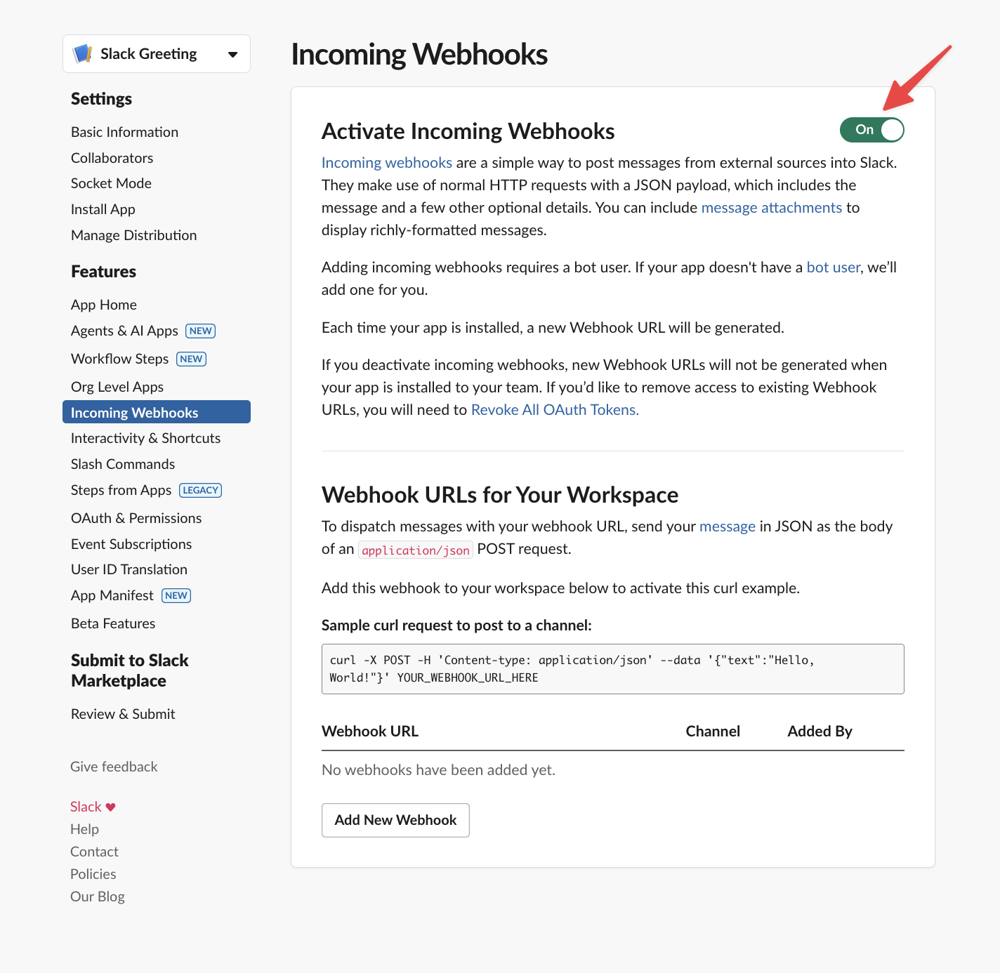
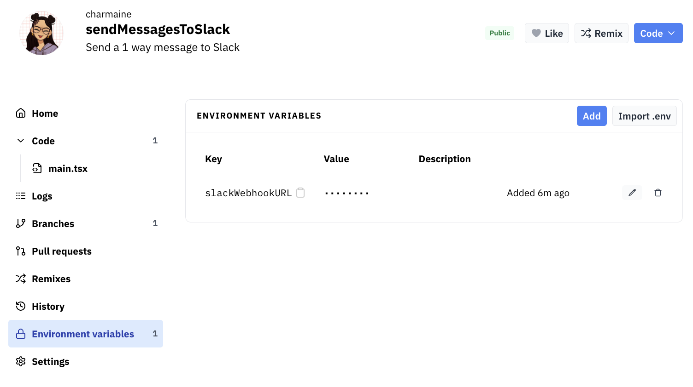
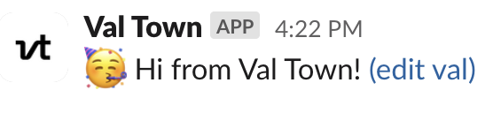

_Time to complete: 5 minutes_

This guide walks you through sending your first Slack message from Val Town.

This guide uses [Slack's incoming webhooks](https://api.slack.com/messaging/webhooks) to send messages to a Slack channel. For more complex interactions, like responding to user messages or handling buttons, check out our [Slack bot guide](/guides/slack/bot/).

## 1. Create a Slack app & webhook

1. [Click here to create a new Slack app](https://api.slack.com/apps?new_app=1)
2. Click **From Scratch**
3. Type an **App Name**
4. Select your Slack workspace



5. Click **Incoming Webhooks** in the left sidebar of your app (under **Features**)
6. Toggle **Activate Incoming Webhooks** to **On**



7. Click **Add New Webhook** at the bottom of the page
8. Select your target channel
9. Copy the **Webhook URL** from Slack
10. (Bonus) Customize the **App icon** under **Basic Information** in the left sidebar ([Val Town icons](https://www.val.town/brand))

## 2. Add the webhook URL to Val Town

1. Click **Environment Variables** in your val's left sidebar
2. Add a new env variable with key: **SLACK_WEBHOOK_URL**
3. Paste the webhook URL you copied from Slack as the value



## 3. Send a message

Now you're ready to send your first message to Slack!

```ts title="Send message" val
import { IncomingWebhook } from "npm:@slack/webhook";

const slack = new IncomingWebhook(Deno.env.get("SLACK_WEBHOOK_URL"));
const EDIT = `<${import.meta.url.replace("esm", "val")}|(edit val)>`;
await slack.send(`🥳 Hi from Val Town! ${EDIT}`);
```



We recommend including this link to the edit val, so everyone on your team is one click away from making changes.

## What's next?

Learn how to [make your message fancy with advanced formatting](https://api.slack.com/messaging/webhooks#advanced_message_formatting).

Take this a step further by responding to mentions, slash commands, buttons, and other user interactions with our full [Slack bot guide](/guides/slack/bot/)!

You can find more Slack examples on our [Templates page](https://www.val.town/explore/use-cases).
