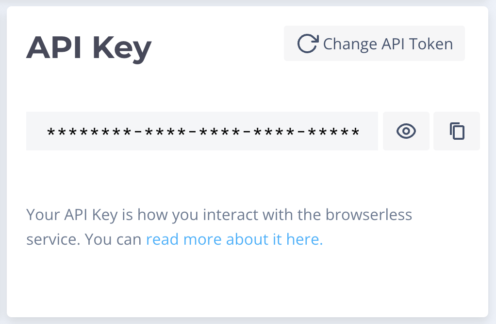

Some websites are partially (or entirely) rendered on the client (aka your web
browser). If you try to search the initial HTML for elements that haven't
finished rendering, you won't find them.

One solution is to use a headless browser that runs a web browser in the
background that fetches the page, renders it, and _then_ allows you to search
the final document.

Services like [Browserless](https://browserless.io/)
provide APIs to interact with a hosted headless browser. For example, their
[/scrape API](https://www.browserless.io/docs/scrape). Here's how to use
Browserless and Val Town to load a webpage.

## Sign up to Browserless and grab your API Key

Copy your API Key from
[https://cloud.browserless.io/account/](https://cloud.browserless.io/account/)
and save it as a Val Town environment variable as `browserless`.



## Make an API call to the [/scrape API](https://www.browserless.io/docs/scrape)

Check the documentation for the
[/scrape API](https://www.browserless.io/docs/scrape) and form your request.

For example, here's how you scrape the introduction paragraph of OpenAI's
wikipedia page.

```ts title="Scrape API example" val
import { fetchJSON } from "https://esm.town/v/stevekrouse/fetchJSON?v=41";

const res = await fetchJSON(
  `https://chrome.browserless.io/scrape?token=${Deno.env.get("browserless")}`,
  {
    method: "POST",
    body: JSON.stringify({
      url: "https://en.wikipedia.org/wiki/OpenAI",
      elements: [
        {
          // The second <p> element on the page
          selector: "p:nth-of-type(2)",
        },
      ],
    }),
  }
);
// For this request, Browserless returns one data item
const data = res.data;
// That contains a single element
const elements = res.data[0].results;
// That we want to turn into its innerText value
const intro = elements[0].text;
return intro;
```

Browserless also has more [APIs](https://www.browserless.io/docs/start) for
taking screenshots and PDFs of websites.

## Alternatively, use Puppeteer and a browser running on Browserless

You can use the [Puppeteer](https://pptr.dev/) library to connect to a browser
instance running on Browserless.

Once you've navigated to a page, you can run arbitrary JavaScript with
`page.evaluate` - like getting the text from a paragraph.

```ts title="Puppeteer example" val
import { PuppeteerDeno } from "https://deno.land/x/puppeteer@16.2.0/src/deno/Puppeteer.ts";

const puppeteer = new PuppeteerDeno({
  productName: "chrome",
});
const browser = await puppeteer.connect({
  browserWSEndpoint: `wss://chrome.browserless.io?token=${Deno.env.get("browserless")}`,
});
const page = await browser.newPage();
await page.goto("https://en.wikipedia.org/wiki/OpenAI");
const intro = await page.evaluate(
  `document.querySelector('p:nth-of-type(2)').innerText`
);
await browser.close();
console.log(intro);
```

```txt title="Logs"
"OpenAI is an American artificial intelligence (AI) research laboratory consisting of the non-profit OpenAI Incorporated and its for-profit subsidiary corporation OpenAI Limited Partnership. OpenAI conducts AI research with the declared intention of promoting and developing friendly AI."
```
