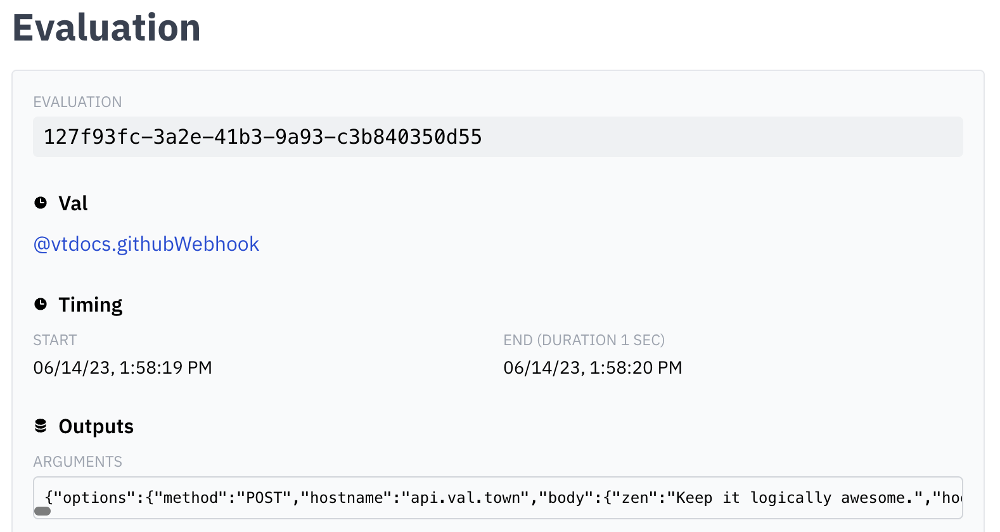

A webhook is another name for a
[Request](https://developer.mozilla.org/en-US/docs/web/api/request) that is sent
between two services on the web. They "hook" into the events that one service
creates and notify another service of what happens. In other words, webhooks
allow you to get realtime notifications.

You can create a webhook handler in Val Town and then register it with the
service you want the notification from. Webhooks are usually created via Val
Town [HTTP Val](/types/http), because it can accept standard HTTP requests.

## Create a webhook handler

Vals that conform to the [HTTP Val](/types/http) pattern accept a
[Request](https://developer.mozilla.org/en-US/docs/web/api/request) as an
argument and return a
[Response](https://developer.mozilla.org/en-US/docs/web/api/response).

Here's an example that connects the [Clerk](http://clerk.com) authentication
service and [Discord](http://discord.com).

```ts title="Discord webhook example" val
import { discordWebhook } from "https://esm.town/v/stevekrouse/discordWebhook?v=3";

// # New Val Town User (on Clerk) -> Val Town Discord notification
// Translates one kind of webhook (Clerk) into another (Discord)
export async function handleDiscordNewUser(req: Request) {
  // check custom auth secret sent from clerk
  if (req.headers.get("auth") !== Deno.env.get("clerkNonSensitive"))
    return new Response("Unauthorized", { status: 401 });
  const body = await req.json();
  await discordWebhook({
    url: Deno.env.get("newUserDiscord"),
    content: body.data.email_addresses[0].email_address +
      " " +
      body.data.profile_image_url,
  });
  return new Response("Success");
}
```

The val above has three parts:

1. It accepts a
   [Request](https://developer.mozilla.org/en-US/docs/web/api/request) and
   checks that it really is from the Clerk by comparing an environment variable.
2. It sends a
   [Request](https://developer.mozilla.org/en-US/docs/web/api/request) to
   Discord to send a message to a channel and `await`s the response.
3. It sends a
   [Response](https://developer.mozilla.org/en-US/docs/web/api/response) back to
   Clerk so that it knows the webhook succeeded.

## Receiving Webhooks

Copy your val's web endpoint using the menu and paste it into your webhook
provider. The webhook provider will POST events to your Val.


You can debug the requests by checking the arguments object in the
[Evaluations tab](https://www.val.town/settings/evaluations).



See also

- [Receiving a GitHub Webhook](/integrations/github/receiving-a-github-webhook)
- [Send Discord message via webhook](/integrations/discord/send-message)
