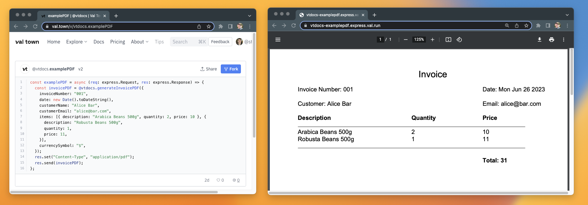

import Val from "@components/Val.astro";

You can generate PDFs using val functions by using an external library like [jsPDF](https://github.com/parallax/jsPDF).

<Val url="https://www.val.town/embed/neverstew.helloWorldPDF" />

Here’s a more comprehensive example that builds an invoice.

<Val url="https://www.val.town/embed/neverstew.examplePDF" />
