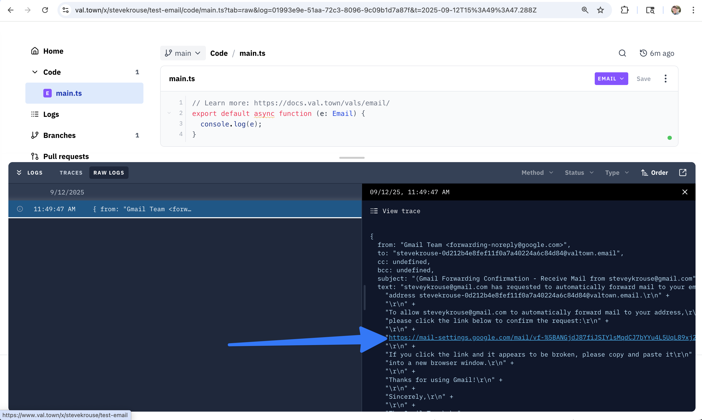

## Gmail forwarding to Val Town

You can set up email forwarding from your Gmail account to your Val Town email address.

1. Create a val with an [email trigger](https://docs.val.town/vals/email/)
2. In that val, log the email object to the console:

```ts
export default async function (e: Email) {
  console.log(e);
}
```

3. Copy that email trigger's email address

4. In [Gmail Forwarding and POP settings](https://mail.google.com/mail/u/0/#settings/fwdandpop), click `Add forwarding address`. If you do not see that button, click `creating a filter`, then add some arbitrary search criteria and click `Create filter`, then you should see the `Add forwarding address` button, which should take you to another `Add forwarding address` button.Paste your val's email address and click `Next` → `Proceed` → `OK`.

5. Gmail will send a confirmation to your val. View the val's logs and click on the confirmation link:



That URL will likely end in `/r/n`, which will make it invalid. Remove the `/r/n` to get it to work. Then click `Confirm`.

6. Back in Gmail settings, you can now set up a filter to forward certain emails to your val's email address. Or you can forward all emails by selecting `Forward a copy of incoming mail to <your val email>`.

7. Click `Save Changes` at the bottom of the page.

## Sending email from Val Town using Gmail SMTP

You can send email from your val using Gmail's SMTP server.

1. In your Google account, go to [Security settings](https://myaccount.google.com/security) and enable 2-Step Verification.

2. After enabling 2-Step Verification, go to [App Passwords](https://myaccount.google.com/apppasswords) and create an app password for "Mail" on "Other" (name it "Val Town" or something similar). Copy the generated password.

3. In your val, set the following environment variables:

- `GMAIL_USER`: Your full Gmail email address
- `GMAIL_PASS`: The app password you generated in step 2

4. Use the following code to send an email using Gmail's SMTP server:

```ts
import nodemailer from "npm:nodemailer";
const transporter = nodemailer.createTransport({
  service: "gmail",
  auth: {
    user: Deno.env.get("GMAIL_USER"),
    pass: Deno.env.get("GMAIL_PASS"),
  },
});

const info = await transporter.sendMail({
  from: Deno.env.get("GMAIL_USER"),
  to: "steve@val.town",
  subject: "Test email from Val Town",
  text: "This is a test email sent from Val Town using Gmail SMTP.",
});
console.log(info);
```

5. Run your val and check the logs and recipient's inbox.

You can ignore any `Failed to resolve IPv4 addresses with current network` message. Nodemailer first tries IPv4 then IPv6, so if IPv4 fails it falls back to IPv6.

### Getting email from Gmail IMAP

You can also fetch emails from your Gmail account using the IMAP protocol.

1. In your Google account, go to [Security settings](https://myaccount.google.com/security) and enable 2-Step Verification.

2. After enabling 2-Step Verification, go to [App Passwords](https://myaccount.google.com/apppasswords) and create an app password for "Mail" on "Other" (name it "Val Town" or something similar). Copy the generated password.

3. Set up the following environment variables in your val:

- `GMAIL_USER`: Your full Gmail email address
- `GMAIL_PASS`: The app password you generated in the previous section

4. Use the following code to fetch emails using IMAP:

```ts
import { ImapFlow } from "npm:imapflow";
const client = new ImapFlow({
  host: "imap.gmail.com",
  port: 993,
  secure: true,
  auth: {
    user: Deno.env.get("GMAIL_USER"),
    pass: Deno.env.get("GMAIL_PASS"),
  },
});
await client.connect();
await client.mailboxOpen("INBOX");
for await (let message of client.fetch("1:*", { envelope: true })) {
  console.log(message.envelope);
}
await client.logout();
```
