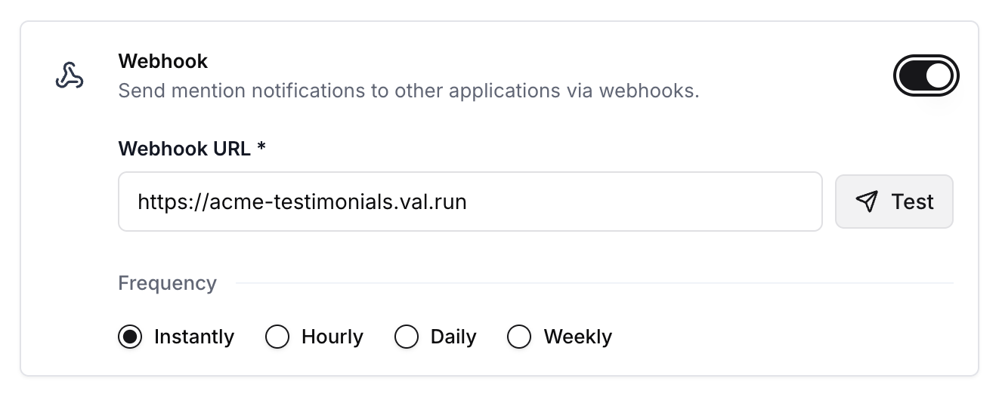
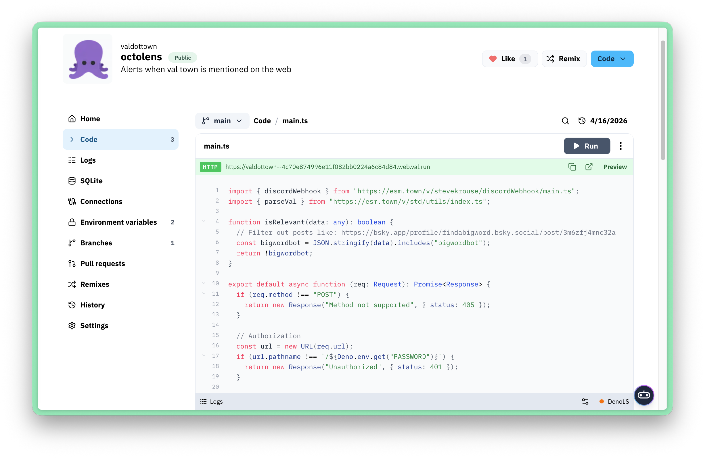
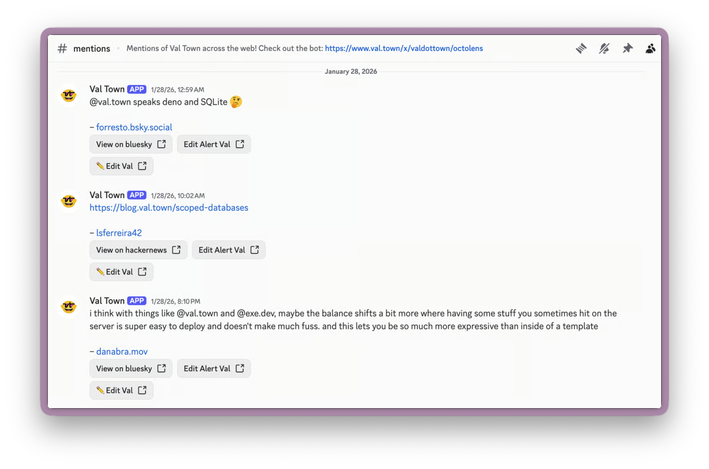

[Octolens](https://octolens.com/) is a social listening tool for tracking mentions of your company across Twitter/X, LinkedIn, GitHub, Reddit, Hacker News, Bluesky, YouTube, TikTok, and other social platforms.

With Octolens webhooks and Val Town, you can act on new mentions however you'd like: add to your CRM, send to Discord, create a testimonials wall, enrich customer leads via RB2B, etc.

## Setup

1. Sign up for an account on [octolens.com](https://octolens.com/) and add keywords to track
2. Create a val to receive keyword mentions (or [remix one](https://www.val.town/x/valdottown/octolens/))
3. Add the val's HTTP endpoint as your [Octolens alert webhook URL](https://app.octolens.com/me/notifications)

To verify that requests to your val are actual webhooks from Octolens, you can append a URL query parameter, `?secret=your_secret_here`, in your Octolens configuration that you check in your val handler. See also [Octolens' docs](https://octolens.com/docs/quickstart/webhooks#customize-your-payload-with-val-town) on sending webhooks to Val Town.

## Example

We use an [octolens](https://www.val.town/x/valdottown/octolens/) val to forward "val.town" mentions to our Discord server.

