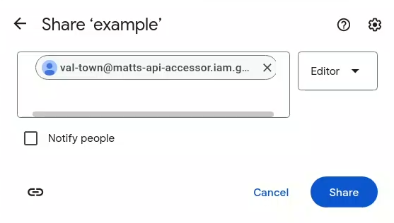

import Val from "@components/Val.astro";

You can use vals to send data to Google Sheets. A common use case for this is collecting
data from incoming HTTP requests or data from a HTTP endpoint on a schedule.

Note that interacting with the Google Sheets API is a fairly complex task due to
its authentication requirements. Luckily, the hard part of creating a service account
only needs to be done once.

To authenticate to the API, the preferred way is with the [OAuth2 server to server flow](https://developers.google.com/identity/protocols/oauth2/service-account),
which performs edits on behalf of a bot account. This means that your vals will
only be able to access the spreadsheets that you explicitly give them access to.

## 1. Setup
This only needs to be done once. Skip to step 2 if you have already created a
Google Cloud service account.

### Create a Google Cloud project
Open the [Google Cloud console](https://console.cloud.google.com/) and click on
the **Select a project** dropdown in the top left.

In the dialog that pops up, click on the **New project** button.

Choose any name for the project name, then click **Create**.

### Enable the Google Sheets API
Open the [Google Sheets API page](https://console.cloud.google.com/apis/library/sheets.googleapis.com),
then doublecheck if the correct project is selected.

Once you have made sure that you are using the correct project, click **Enable**.

### Create a service account
On the left of the screen, click on **Credentials**.

On the bar at the top, click on the **Create credentials** button, then select
**Service account**.

Enter any name for the **Service account name**. You may also enter a description,
as you see fit.

Save the email address for later, as it will be required to add the service account
to a Google Sheet.

Click **Done**, as granting permissions to this service account is not required.

### Create a service account key
To the right of the screen, open the menu on the newly created service account,
and click **Manage keys**.

Click **Add key**, then **Create new key**.

Click **Create key**. Leave the type as JSON.

You will get a JSON file in your downloads directory.

### Import the key into Val Town
Open the service account key JSON file in a text editor, and copy the full contents.

Open the [Environment Variables](https://www.val.town/settings/environment-variables) page,
then click **New env variable**.

Set the key to a name like `google_service_account`, then paste the entire JSON data into the value.

Once you are finished, click **Add**.

## 2. Create a sheet and grant access
Open [Google Sheets](https://docs.google.com/spreadsheets/u/0/) and create a new empty sheet or open an existing one.

Click the Share button, then paste your service account's email into the dialog.
Make sure it is added as an editor, and optionally disable "Notify people".

Lastly, copy the sheet ID from the URL bar. It's the long string of characters between `/d/` and `/edit`.

## 3. Create a val to send data
To interact with the Google Sheets API, use the [@mattx.gsheet_call](https://www.val.town/v/mattx/gsheet_call) wrapper.

This automates requesting an access token from Google to access the Google Sheets API.

It requires 4 arguments:
- The contents of your service account JSON file: in almost all cases, this should be retrieved from environment variables
  using - for example, `Deno.env.get("google_service_account")`.
- The sheet ID
- The action to perform: This parameter is the part of the URL that comes after `https://sheets.googleapis.com/v4/spreadsheets/{spreadsheetId}/`,
  along with any URL parameters that might be required (often this is `valueInputOption`).
  For example, for [spreadsheets.values.append](https://developers.google.com/sheets/api/reference/rest/v4/spreadsheets.values/append),
  this will be `values/{range}:append?valueInputOption=RAW`, where `{range}` needs to be substituted for a range like `A1:C3`.
- The request body: In the same example as above, the request body could be\
  `{values: [[1, 2, 3]]}`.
  Notice that this is an array of arrays, [in line with the API documentation](https://developers.google.com/sheets/api/reference/rest/v4/spreadsheets.values#ValueRange).

Here is an example of what the above looks like when put together:

<Val url="https://www.val.town/embed/mattx/gsheet_example" />

