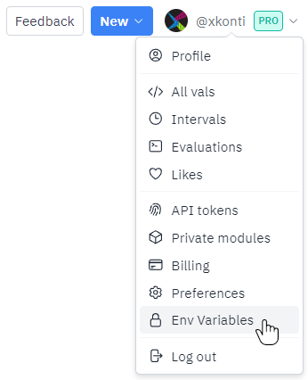
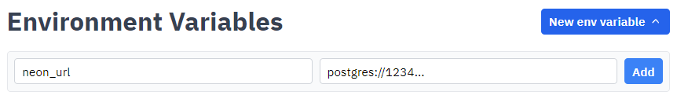

import Val from "@components/Val.astro";

Neon provides a PostgreSQL database with an API accessible over HTTP
and a JavaScript SDK. This lets you use a more
conventional relational database model in your vals.

## Setup

Login to your Neon account, then click Create a project:


Fill out the fields:

- Name: Any.
- Postgres version: If you need to use the database with other software, 14 provides better compatibility. Else, use the default of 15.
- Region: Choose any US region for lower latency.

Your settings should look similar to the following:


You should then get a dialog with connection details. Select the PostgreSQL connection URL highlighted in green without the quotation marks around it, then copy it:


Go to [val.town](https://val.town), click on your profile picture and click **Env Variables**.



Click **New env variable**, then set the key to a name you'd like to use to reference the environment variable and the value to the connection URL you just copied:



You can then use deno-postgres to connect to the database like so:

```ts title="Example" val
import { Client } from "https://deno.land/x/postgres/mod.ts";
const client = new Client(Deno.env.get("neon_url"));
await client.connect();
const result = await client.queryObject`select CURRENT_TIME;`;
console.log(result);
```

Note that you might need to change the environment variable name according to the key you set earlier.

While writing your code, remember that you should use prepared statements for any queries containing user data (or any query that has to change with new data) to prevent SQL injection attacks. You can find the 3 ways of going about this at [https://deno-postgres.com/#/?id=prepared-statements-and-query-arguments](https://deno-postgres.com/#/?id=prepared-statements-and-query-arguments).
