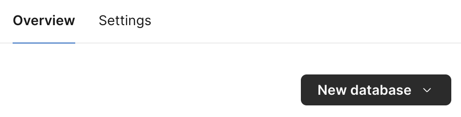

import Val from "@components/Val.astro";

[PlanetScale](https://planetscale.com/) provide a hosted MySQL database with 5GB
of storage included in the [free tier](https://planetscale.com/pricing).

## 1. Sign up to PlanetScale

Go to
[https://auth.planetscale.com/sign-up](https://auth.planetscale.com/sign-up)

## 2. Create a new database

Select **New database** on the dashboard.

Create a database.




## 3. Create a password

Go to **Settings** → **Passwords** and click **New password**.


Save the `host`, `username`, and `password` values as
[Val Town environment variables](https://www.val.town/settings/environment-variables) - use
`planetScaleHost`, `planetScaleUsername`, and `planetScalePassword`
respectively.


## 4. Create your first table

Copy and paste this val to create a table with the given schema.

```ts val
import process from "node:process";
import { queryPlanetScale } from "https://esm.town/v/vtdocs/queryPlanetScale";

export const planetScaleCreateStockTable = queryPlanetScale(
  {
    host: process.env.planetScaleHost,
    username: process.env.planetScaleUsername,
    password: process.env.planetScalePassword,
  },
  `CREATE TABLE stock (
  id int NOT NULL AUTO_INCREMENT PRIMARY KEY,
  name varchar(255) NOT NULL,
  price varchar(255) NOT NULL
);`
);
```

## 5. Insert an item

Insert one or more items.

```ts val
import process from "node:process";
import { queryPlanetScale } from "https://esm.town/v/vtdocs/queryPlanetScale";

export const planetScaleInsertStockTable = queryPlanetScale(
  {
    host: process.env.planetScaleHost,
    username: process.env.planetScaleUsername,
    password: process.env.planetScalePassword,
  },
  `INSERT INTO stock (name, price) VALUES (?, ?);`,
  ["banana", 15]
);
```

## 6. Query an item

Use the `rows` property to get your query results - or return the entire
`results` object to see what other data is available.

```ts val
import process from "node:process";
import { queryPlanetScale } from "https://esm.town/v/vtdocs/queryPlanetScale";

export const planetScaleSelectStockTable = (async () => {
  const results = await queryPlanetScale(
    {
      host: process.env.planetScaleHost,
      username: process.env.planetScaleUsername,
      password: process.env.planetScalePassword,
    },
    `SELECT id, name, price FROM stock WHERE name=?`,
    ["banana"]
  );
  return results.rows[0];
})();
```

## 7. Do more than queries!

Read the source of the
[@vtdocs/queryPlanetScale](https://www.val.town/v/vtdocs/queryPlanetScale)
helper, see how it uses the `@planetscale/database` SDK, refer to the
[driver's documentation](https://github.com/planetscale/database-js), and extend
it!

<Val url="https://www.val.town/embed/vtdocs.queryPlanetScale" />
