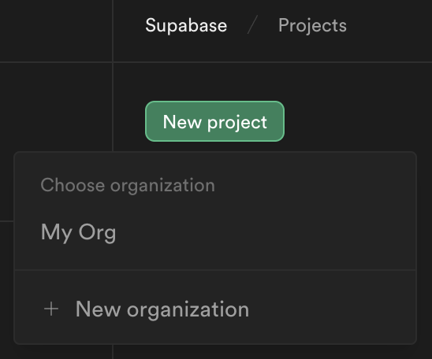
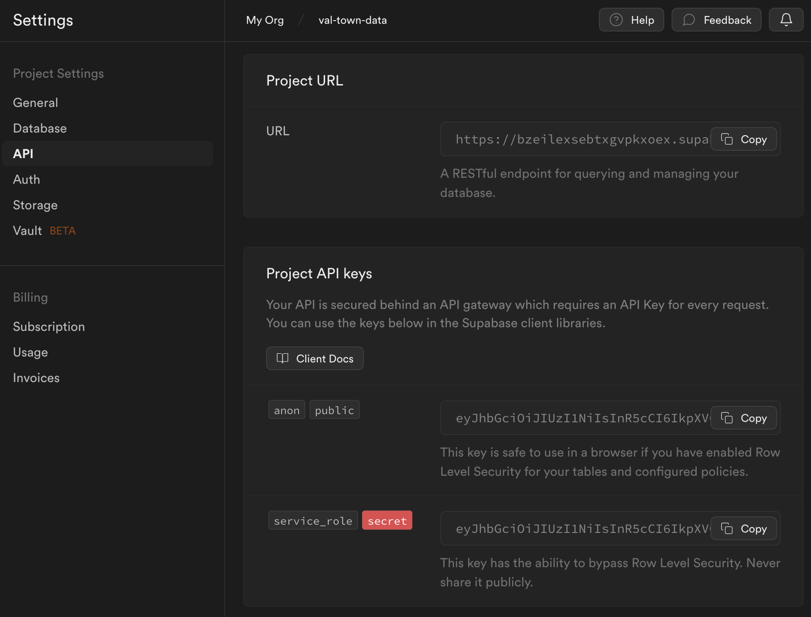
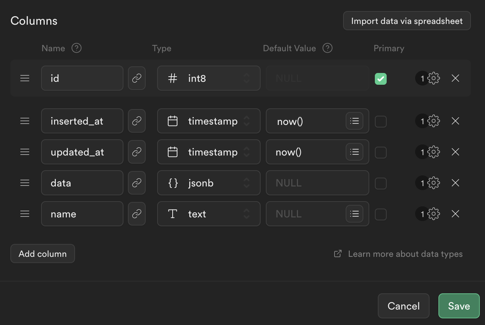

import Val from "@components/Val.astro";

[Supabase](https://supabase.com/) provide a hosted Postgres database with 500MB
of storage in the [free tier](https://supabase.com/pricing).

You can query and create data inside your vals using either Supabase's
JavaScript SDK, or a Postgres client.

## Using the SDK

### 1. Sign up to Supabase

Visit
[https://supabase.com/dashboard/sign-up](https://supabase.com/dashboard/sign-up).

### 2. Create a project

On Supabase's [dashboard](https://supabase.com/dashboard/projects), create a new
project.



### 3. Get your API URL and service role key

Go to your project's **Settings** via the sidebar. Inside **API**, scroll down
and copy the **Project URL,** and then, inside **Project API Keys**, copy the
**service role** secret. Save these as two separate
[Val Town environment variables](https://www.val.town/settings/environment-variables) as `supabaseURL` and
`supabaseKey` respectively.



### 4. Create your first table

Head to the **Table editor** in the sidebar.


**Create a new table** called `my_first_table` with the following schema.



### 5. Insert some data

Copy and paste the following val to insert some data.

```ts val
import process from "node:process";

export const supabaseSDKInsertIntoMyFirstTable = (async () => {
  const { createClient } = await import(
    "https://esm.sh/@supabase/supabase-js@2"
  );
  const supabase = createClient(
    process.env.supabaseURL,
    process.env.supabaseKey
  );
  const { data, error } = await supabase
    .from("my_first_table")
    .insert({ name: "Alice", data: { job: "software engineer" } });
  if (error) {
    throw error;
  }
})();
```

### 6. Query back that data

Get back the data you just inserted by using `eq()` (like SQL's `WHERE`).

```ts val
import process from "node:process";

export const supabaseSDKSelectMyFirstTable = (async () => {
  const { createClient } = await import(
    "https://esm.sh/@supabase/supabase-js@2"
  );
  const supabase = createClient(
    process.env.supabaseURL,
    process.env.supabaseKey
  );
  const { data, error } = await supabase
    .from("my_first_table")
    .select("name, data")
    .eq("name", "Alice")
    .limit(1);
  if (error) {
    throw error;
  }
  return data;
})();
```

### 7. Keep going!

Use Supabase's
[JavaScript Client library documentation](https://supabase.com/docs/reference/javascript/select)
to write more queries!

## Using a Postgres client

### 1. Sign up to Supabase

Visit
[https://supabase.com/dashboard/sign-up](https://supabase.com/dashboard/sign-up).

### 2. Create a project

On Supabase's [dashboard](https://supabase.com/dashboard/projects), create a new
project.


Keep a note of your database password, you'll need this to create a database
connection string.


### 3. Get your database's connection string


Go to your project's **Settings** via the sidebar. Inside **Database**, scroll
down and copy the **Connection string** for **Nodejs**. Replace
`[YOUR-PASSWORD]` (removing the square brackets) with your database password
(alternatively, reset your database password to create a new one).

Save this connection string as a
[Val Town environment variable](https://www.val.town/settings/environment-variables) as `supabasePostgres`.

### 4. Create your first table

Copy and paste this val to create a table with the given schema.

```ts val
import process from "node:process";
import { supaBaseQuery } from "https://esm.town/v/vtdocs/supaBaseQuery";

export const supabaseCreateMyFirstTable = supaBaseQuery(
  process.env.supabasePostgres,
  `create table my_first_table (
  id bigint generated by default as identity primary key,
  inserted_at timestamp with time zone default timezone('utc'::text, now()) not null,
  updated_at timestamp with time zone default timezone('utc'::text, now()) not null,
  data jsonb,
  name text
);`
);
```

### 5. Insert some data

Use a
[prepared statement](https://deno-postgres.com/#/?id=prepared-statements-and-query-arguments)
like below to prevent
[SQL injection](https://en.wikipedia.org/wiki/SQL_injection).

```ts val
import process from "node:process";
import { supaBaseQuery } from "https://esm.town/v/vtdocs/supaBaseQuery";

export const supabaseInsertIntoMyFirstTable = supaBaseQuery(
  process.env.supabasePostgres,
  `INSERT INTO MY_FIRST_TABLE (NAME, DATA) VALUES ($1, $2);`,
  ["Alice", '{"job": "software engineer"}']
);
```

### 6. Query back that data

Usually, you'll just want the `rows` property from the response.

```ts val
import process from "node:process";
import { supaBaseQuery } from "https://esm.town/v/vtdocs/supaBaseQuery";

export const supabaseSelectMyFirstTable = supaBaseQuery(
  process.env.supabasePostgres,
  `SELECT NAME, DATA FROM MY_FIRST_TABLE WHERE NAME = $1;`,
  ["Alice"]
);
```

### 7. More resources

Learn more about the [Deno Postgres client](https://deno-postgres.com/) used in
this guide, view the Supabase
[Database documentation](https://supabase.com/docs/guides/database), or get help
on [Val Town's Discord](https://discord.gg/dHv45uN5RY).
