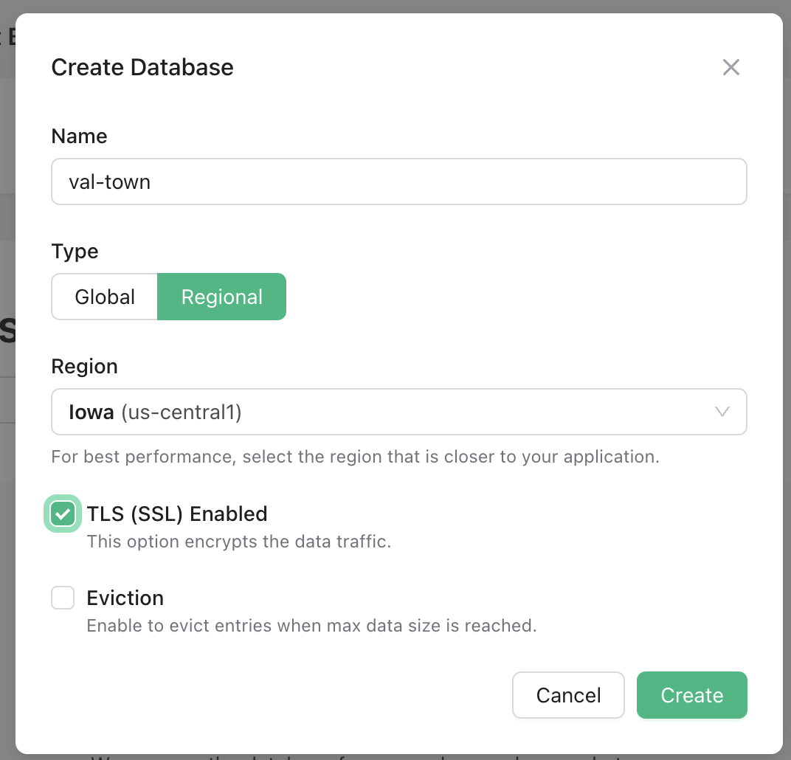

import Val from "@components/Val.astro";

Upstash provides a serverless Redis database, which can be used as a key-value
store of up to 1mb with a free account.

## Create an Upstash account

Go to [https://console.upstash.com/login](https://console.upstash.com/login)

## Create a database

1. Click **Create database**


1. **Name**: whatever you want.
2. **Type**: Regional
3. **Region**: Iowa (us-central1), because it's closest to Val Town's servers.
4. **Enable TLS** for security.



## Add REST credentials to Val Town Secrets

1. Go to [val.town/settings/environment-variables](https://www.val.town/settings/environment-variables)
2. For `UPSTASH_REDIS_REST_URL` and the `UPSTASH_REDIS_REST_TOKEN` each:
   1. Click **New env variable**.
   2. Set the names to `upstashURL` and `upstashToken`, respectively
   3. Copy & paste in the value
   4. Click **Add**

Upstash:


Val Town:


## Set some data

If you set it up correctly, you should be able to copy & paste this Val and have
it return the same results from your own Upstash database

```ts val
import process from "node:process";

export const upstashEx = (async () => {
  const { Redis } = await import("npm:@upstash/redis");
  const redis = new Redis({
    url: process.env.upstashURL,
    token: process.env.upstashToken,
  });
  console.log(await redis.set("foo", "bar"));
  console.log(await redis.get("foo"));
})();
```

## Saving JSON

JSON is automatically stringified and parsed so you can set it and get it
directly. You can store a JSON object of up to 1mb this way with a free acount.

```ts val
import process from "node:process";

export const upstashJSONEx = (async () => {
  const { Redis } = await import("npm:@upstash/redis");
  const redis = new Redis({
    url: process.env.upstashURL,
    token: process.env.upstashToken,
  });
  await redis.set("json-ex-1", { a: { b: "nested json" } });
  return ((await redis.get("json-ex-1")) as any).a.b;
})();
```

## Further resources

1. [Upstash Redis SDK Docs](https://docs.upstash.com/redis/sdks/javascriptsdk/overview)
2. [Redis tutorial](https://redis.io/docs/data-types/tutorial/)

Thanks to [@mattx](https://www.val.town/mattx) for contributions to this
resource!
