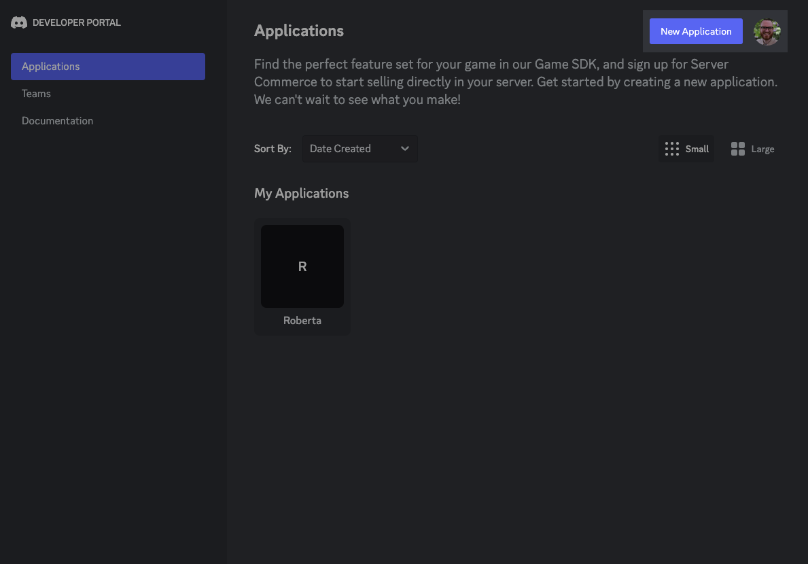
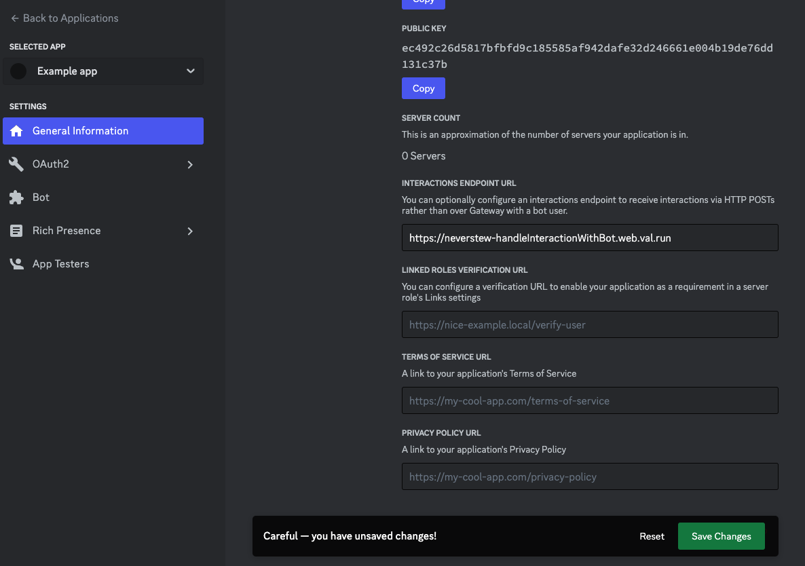

import Val from "@components/Val.astro";


## Introduction

By the end of this tutorial you will have a Discord bot hosted 24/7, for free,
forever, on [Val Town](https://val.town), that responds to a basic `/ping`
[Slash Command](https://support.discord.com/hc/en-us/articles/1500000368501-Slash-Commands-FAQ).

[Val Town](https://val.town) is a social website to write, and deploy JavaScript
from the browser.

No prior coding experience required. The vast majority of this tutorial is
creating the bot on Discord and pasting your keys into Val Town. The actual
coding parts are just clicking **Run** two times to remix two pieces
of code to your Val Town account.

:::note

💡 If you get stuck,
[come join us in the Val Town Discord](https://discord.gg/dHv45uN5RY)!

:::

## Video Tutorial

If you prefer videos, here's this same tutorial in a 3-minute YouTube video.

[https://youtu.be/yYXmInPSSfg](https://youtu.be/yYXmInPSSfg)

## Step 1: Create a Discord app

1. Go to the
   [Discord Developer Portal](https://discord.com/developers/applications) and
   select "New Application" in the top right



1. Enter a name for your Bot, accept the terms and press Create.


## Step 2: Add the bot to your server

To invite your new bot to your server, you need to generate a link to click on.

1. Head to the **Oauth2** > **URL Generator** page.
2. Select the `bot` scope, then the `Send Messages` permission.


1. **Copy** the URL at the bottom of the page and paste it into a new browser
   tab.
2. Click through the steps until you're prompted to choose your server and press
   **Continue**.


1. Press **Authorize**.


🎉 Your bot is now a member of your server! Now let's get it to respond to Slash
Commands.

## Step 3: Login to Val Town

[Val Town](https://val.town/) is a social website to write, run, and host
JavaScript. You can create APIs, scheduled functions, email yourself, and
persist small pieces of data — all from the browser and instantly deployed.
There is a generous free plan, and no credit card required.

1. [Login](https://val.town/auth/signin) or
   [create an account](https://www.val.town/auth/signup).

## Step 4: Save bot secrets

1. Go to the "General Information" page


1. **Copy** your Application ID
2. Go to [val.town/settings/environment-variables](https://www.val.town/settings/environment-variables)
3. Create a new environment variable called `discordAppId` and paste in the value
4. **Copy** your Public Key, saving it as `discordPublicKey`
5. Go to the Bot page
6. Click **Reset Token** and accept the warning


1. **Copy** and paste it in
   [val.town/settings/environment-variables](https://www.val.town/settings/environment-variables) as
   `discordBotToken`.

## Step 5: Register a new Slash Command

1. The embedded code below should have your name in the top-left corner. If you
   see **anonymous**, refresh this page. If you
   still see **anonymous**, ensure
   [you're logged into Val Town](https://www.val.town/auth/signin).
2. Press **Run** to add the `/ping` command to your bot.

```ts title="Register /ping command" val
import { registerDiscordSlashCommand } from "https://esm.town/v/neverstew/registerDiscordSlashCommand";

const result = await registerDiscordSlashCommand(
  Deno.env.get("discordAppId"),
  Deno.env.get("discordBotToken"),
  {
    name: "ping",
    description: "Say hi to your bot",
  },
);
export const registerDiscordCommand = result.json();
```

## Step 6: Listen for Slash Commands

1. Press **Run** to listen for Slash Commands and reply.

<Val url="https://www.val.town/embed/maxm/discordBotExample" />

2. Next to your val's name, click 🔒 > **Unlisted.**
3. In the val above, in the bottom-left corner of the val, click **Script** and change it to **HTTP.**
4. Click on the URL at the bottom of that val that looks like
   [https://username-handleDiscordInteraction.web.val.run](https://stevekrouse-handlediscordinteraction.web.val.run/)
5. Visit the General Information page for your bot and paste your copied
   endpoint into **INTERACTIONS ENDPOINT URL** and click **Save
   Changes**.



## 💬 Try it out

Refresh Discord and try out your bot using `/ping`


## Further Directions

Now that you have a basic Discord Bot setup, you'll want to customize it to do
exactly what you want. You'll probably want to:

1. Register a new Slash Command
2. Connect your bot to APIs like OpenAI's GPT or Dall-E

[Come join us in the Val Town Discord](https://discord.gg/dHv45uN5RY) if you get
stuck, have questions, or want to show off your cool new bot!
