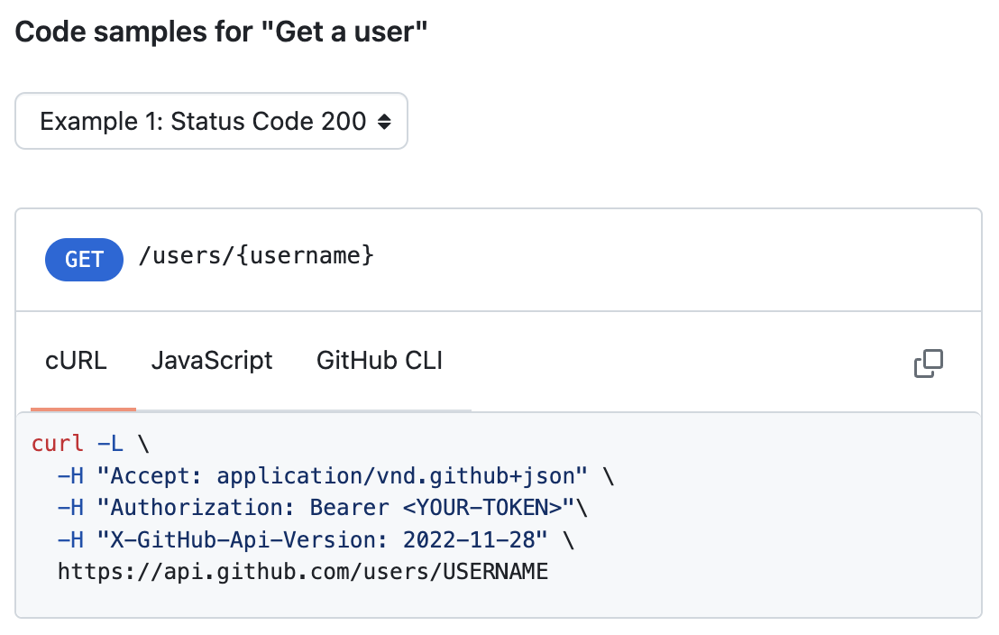

import Val from "@components/Val.astro";

For example, we can get a user without passing an authentication token.

GitHub API endpoints have a cURL command that you can manually translate into a `fetchJSON` call (e.g. see [Get a user](https://docs.github.com/en/rest/users/users?apiVersion=2022-11-28#get-a-user)).

Here’s a Val that returns a GitHub user object for a given username:

<Val url="https://www.val.town/embed/vtdocs.getGithubUser" />

You can fork it and alter it, or just call it directly like this:

<Val url="https://www.val.town/embed/vtdocs.getSteve" />

You can also do this with [octokit.js](https://github.com/octokit/octokit.js). Reminder: import npm packages by prepending the package name with `npm:`.

<Val url="https://www.val.town/embed/vtdocs.getGithubUserViaOctokit" />
