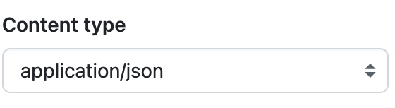
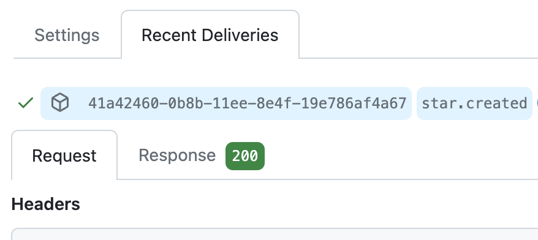

GitHub supports sending webhooks for a
[number of events](https://docs.github.com/en/webhooks-and-events/webhooks/webhook-events-and-payloads).
In this example, you'll use `console.email` to receive an email when someone
stars your GitHub repository.

First, create an Web API handler function val to receive star webhooks from
GitHub, or use this one:

```ts title="GitHub star webhook" val
import { email } from "https://esm.town/v/std/email?v=11";

export const githubStarWebhook = async (req: Request) => {
  const { action, sender, repository } = await req.json();
  if (action === "created") {
    email({ text: `Repository ${repository.full_name} starred by ${sender.login}` });
  }
  return new Response("OK", { status: 200 });
};
```

Go to the **Webhooks** tab in your GitHub repository's settings.

Get your val's web endpoint URL (via the menu) and paste it in the **Payload
URL.**


Be sure to set the content type to `application/json` so that it's super easy
for us to extract the data out of it.



You can filter for the specific events you want to receive, or opt to choose
everything.

To just star events, toggle the checkbox inside _Let me select individual
events._


When your GitHub repository is starred, GitHub will sends a webhook payload,
which is handled by your val, and you get an email!

You can debug this on the GitHub side by looking at the Recent Deliveries page
of your webhook.



## Securing GitHub Webhooks

Once public, your val function will listen for any payload sent to its endpoint.
For security reasons, you probably want to limit requests to those coming from
GitHub. One method is to add a secret token and perform validation.

Edit your existing webhook on GitHub and in the **Secret** field, add a random
string with high entropy. Add this to your
[environment variables](/reference/environment-variables/) on Val Town as `githubWebhookToken`.


GitHub uses this secret to create a hash signature with each payload. This hash
signature is sent as a header: `x-hub-signature-256`.

With your secret, the payload, and the signature header, you can use Octokit's
[verify](https://github.com/octokit/webhooks.js/#webhooksverify) function to
confirm that the webhook came from GitHub. Here's a val that does that for you:

```ts title="@vtdocs/verifyGithubWebhookSignature" val
export const verifyGithubWebhookSignature = async (
  secret: string,
  payload: string,
  signatureHeader: string,
) => {
  const { verify } = await import(
    "https://esm.sh/@octokit/webhooks-methods@3.0.2?pin=v106"
  );
  return await verify(secret, payload, signatureHeader) === true;
};
```

It can be integrated into the original example like this:

```ts title="Improved GitHub star webhook" val
import { email } from "https://esm.town/v/std/email?v=11";
import { verifyGithubWebhookSignature } from "https://esm.town/v/vtdocs/verifyGithubWebhookSignature?v=2";

export const githubWebhookWithVerify = async (req: Request) => {
  const payload = await req.json();
  const verified = await verifyGithubWebhookSignature(
    Deno.env.get("githubWebhookToken"),
    JSON.stringify(payload),
    req.headers.get("X-Hub-Signature-256"),
  );
  if (!verified) {
    return new Response("Unauthorized", { status: 401 });
  }
  const { action, sender, repository } = payload;
  if (action === "created") {
    email({ text: `Repository ${repository.full_name} starred by ${sender.login}` });
  }
  return new Response("OK", { status: 200 });
};
```

With your webhook pointing to the new example, your val now refuses payload that
don't come from GitHub!

Read more: GitHub has an in-depth guide on
[Securing your webhooks](https://docs.github.com/en/webhooks-and-events/webhooks/securing-your-webhooks).
