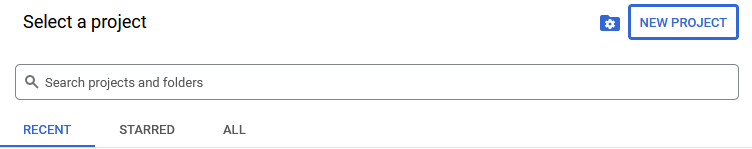
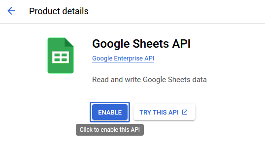
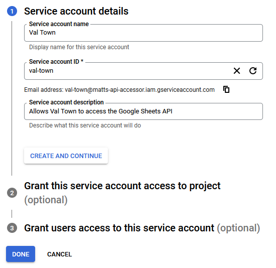
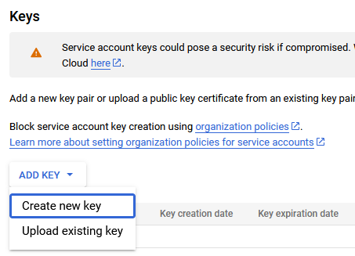
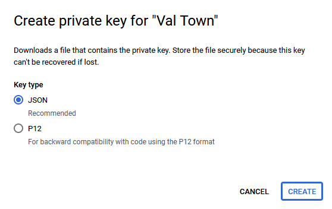
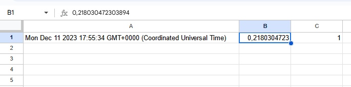

import Val from "@components/Val.astro";

You can send data to Google Sheets from a val. You can collect
data from incoming HTTP requests or from a HTTP endpoint on a schedule.

Authencating with the Google Sheets API is a bit tricky, but we walk you through it below. It should only take a few minutes, and only needs to be done once.

Google reccomends [OAuth2 server to server authentication](https://developers.google.com/identity/protocols/oauth2/service-account) for bot-based applications. We will walk you through creating a Google Cloud service account, giving it access to one of your Google Sheets, and using its key to make authenticated requests to the Google Sheets API.

## 1. Create a Google Cloud service account

[Creating a Google Cloud service account](https://developers.google.com/identity/protocols/oauth2/service-account#creatinganaccount) is the reccomended way to authenticate to the Google Sheets API.

### a. Create a Google Cloud project

Open the [Google Cloud console](https://console.cloud.google.com/) and click on
the **Select a project** dropdown in the top left.

In the dialog that pops up, click on the **New project** button.

Choose any name for the project name, then click **Create**.

### b. Enable the Google Sheets API

Open the [Google Sheets API page](https://console.cloud.google.com/apis/library/sheets.googleapis.com),
then double check if the correct project is selected.

Once you have made sure that you are using the correct project, click **Enable**.

### c. Create a service account

On the left of the screen, click on **Credentials**.

On the bar at the top, click on the **Create credentials** button, then select
**Service account**.

Enter any name for the **Service account name**. You may also enter a description,
as you see fit.

Save the email address for later, as it will be required to add the service account
to a Google Sheet.

Click **Done**, as granting permissions to this service account is not required.

### d. Create a service account key

To the right of the screen, open the menu on the newly created service account,
and click **Manage keys**.

Click **Add key**, then **Create new key**.

Click **Create key**. Leave the type as JSON.

You will get a JSON file in your downloads directory.

### e. Import the key into Val Town

Open the service account key JSON file in a text editor, and copy the full contents.

Open the [Environment Variables](https://www.val.town/settings/environment-variables) page,
then click **New env variable**.

Set the key to a name like `google_service_account`, then paste the entire JSON data into the value.

Once you are finished, click **Add**.

## 2. Create a sheet and grant access

Open [Google Sheets](https://docs.google.com/spreadsheets/u/0/) and create a new empty sheet or open an existing one.

Click the Share button, then paste your service account's email into the dialog.
Make sure it is added as an editor, and optionally disable "Notify people".

Lastly, copy the sheet ID from the URL bar. It's the long string of characters between `/d/` and `/edit`.

## 3. Create a val to send data

To interact with the Google Sheets API, use the [@mattx.gsheet_call](https://www.val.town/v/mattx/gsheet_call) wrapper.

This automates requesting an access token from Google to access the Google Sheets API.

It requires 4 arguments:

- The contents of your service account JSON file: in almost all cases, this should be retrieved from environment variables
  using - for example, `Deno.env.get("google_service_account")`.
- The sheet ID
- The action to perform: This parameter is the part of the URL that comes after `https://sheets.googleapis.com/v4/spreadsheets/{spreadsheetId}/`,
  along with any URL parameters that might be required (often this is `valueInputOption`).
  For example, for [spreadsheets.values.append](https://developers.google.com/sheets/api/reference/rest/v4/spreadsheets.values/append),
  this will be `values/{range}:append?valueInputOption=RAW`, where `{range}` needs to be substituted for a range like `A1:C3`. You can find a list of available actions in the [Google Sheets API reference](https://developers.google.com/sheets/api/reference/rest/v4/spreadsheets.values).
- The request body: In the same example as above, the request body could be\
  `{values: [[1, 2, 3]]}`.
  Notice that this is an array of arrays, [in line with the API documentation](https://developers.google.com/sheets/api/reference/rest/v4/spreadsheets.values#ValueRange).

Here is an example of what the above looks like when put together:

<Val url="https://www.val.town/embed/mattx/gsheet_example" />

