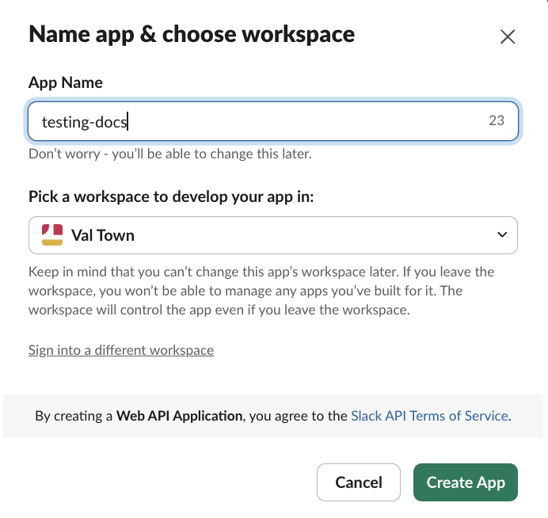
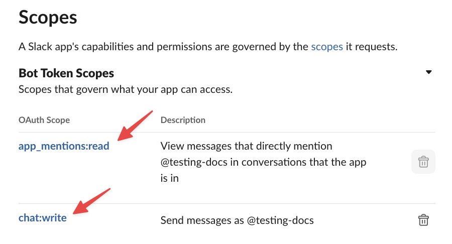
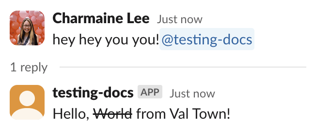

import Val from "@components/Val.astro";
import { LinkButton } from "@astrojs/starlight/components";

Val Town is the easiest way to self-host an interactive Slack bot - everything is configured on the web with no local development required. It's free and easily shareable.

Bots respond to mentions, slash commands, buttons, modals, and other user interactions.

This builds on the [webhook approach](./1-send-messages.mdx) to add interactivity.

<LinkButton
  href="https://api.slack.com/interactivity/handling"
  variant="secondary"
  icon="external"
  iconPlacement="start"
>
  Docs: Handling Slack Interactivity
</LinkButton>

<LinkButton
  href="https://api.slack.com/apps?new_app=1"
  variant="secondary"
  icon="external"
  iconPlacement="start"
>
  Create a Slack App
</LinkButton>

## Step 1: Remix the bot template

1. [Remix this val](https://www.val.town/x/charmaine/slackBotExample/code/main.tsx) to get started:

<Val url="https://www.val.town/embed/x/charmaine/slackBotExample/main.tsx" />

2. Copy the HTTP endpoint URL (via the ... menu for `main.tsx`) - this is where Slack will send events to your Val Town bot.

## Step 2: Create a Slack app

1. Go to [Slack API](https://api.slack.com/apps?new_app=1) and create a new app **From Scratch**
2. Name your app and select your workspace

## Step 3: Add environment variables

In your val's sidebar, add these **Environment Variables**:
- **slackVerificationToken**: From **Settings → Basic Information → Verification Token**
- **slackToken**: Leave empty (you'll fill this after installing)

## Step 4: Set up events

1. Go to **Features → Event Subscriptions**
2. Enable events and paste your val's HTTP endpoint in **Request URL**
3. Subscribe to **app_mention** under **Subscribe to bot events**

## Step 5: Set bot permissions

In **OAuth & Permissions → Scopes**, add:
- `app_mentions:read` (should already be there)
- `chat:write`

## Step 6: Install your app

Go to **Settings → Install App** and install to your workspace.

## Step 7: Add OAuth token

1. Copy the **Bot User OAuth Token** from **OAuth & Permissions**
2. Update your val's **slackToken** environment variable

## Step 8: Test your bot

1. Invite the bot to a channel

2. Mention the bot - it will reply!

## What's next?

Want to send simple notifications without interactivity? Check out our [Slack webhook guide](./1-send-messages.mdx).

You can find more Slack examples on our [Templates page](https://www.val.town/explore/use-cases).
