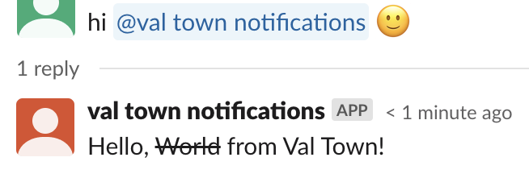
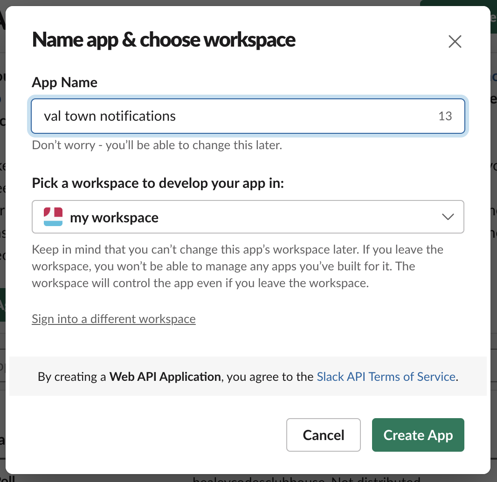
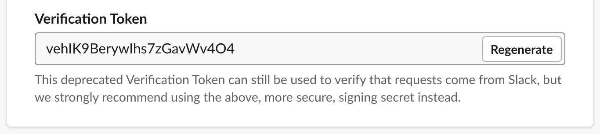
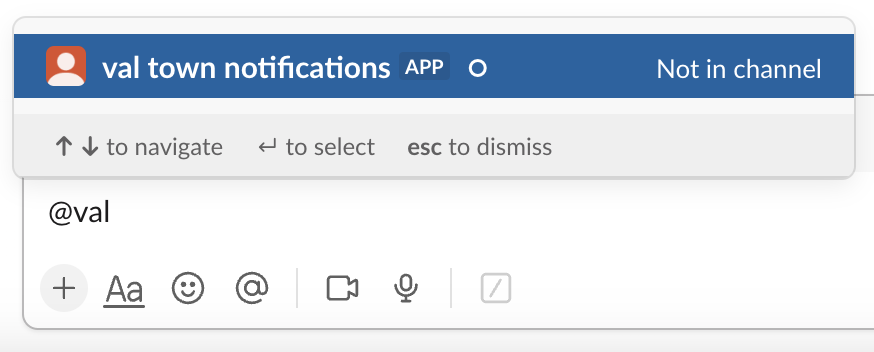

You can build a Slack bot using vals.

Vals can receive events from Slack's
[Events API](https://api.slack.com/apis/connections/events-api) via the Express
API. In this guide, you'll build a bot that replies whenever it's mentioned.



## 1. Create a Slack app

Visit
[https://api.slack.com/apps?new_app=1](https://api.slack.com/apps?new_app=1),
create a new app **From Scratch**, and choose your **App Name** and your
workspace.



## 2. Save your app's verification token

When your handler val receives requests, you can verify that they were sent by
Slack by looking for the verification token.

To find your app's verification token, go to **Settings** → **Basic
Information** in the side bar. Scroll down to **App Credentials**.



Save the **Verification Token** as a
[Val Town environment variable](https://www.val.town/settings/environment-variables) as
`slackVerificationToken`.

## 3. Create a val that will respond to the challenge and reply when it's mentioned

When you add a **Request URL**, Slack will immediately send a challenge to
verify the endpoint is correct.

Run this val that responds to the challenge, and replies to `app_mention`
events.

```ts title="Reply to message" val
import { fetchJSON } from "https://esm.town/v/stevekrouse/fetchJSON?v=41";

export const slackReplyToMessage = async (req: Request) => {
  const body = await req.json();
  // Verify the request is genuine
  if (body.token !== Deno.env.get("slackVerificationToken")) {
    return new Response(undefined, { status: 401 });
  }
  // Respond to the initial challenge (when events are enabled)
  if (body.challenge) {
    return Response.json({ challenge: body.challenge });
  }
  // Reply to app_mention events
  if (body.event.type === "app_mention") {
    // Note: `body.event` has information about the event
    // like the sender and the message text
    const result = await fetchJSON(
      "https://slack.com/api/chat.postMessage",
      {
        headers: {
          "Authorization": `Bearer ${Deno.env.get("slackToken")}`,
        },
        method: "POST",
        body: JSON.stringify({
          channel: body.event.channel,
          thread_ts: body.event.ts,
          text: "Hello, ~World~ from Val Town!",
        }),
      },
    );
    // Slack replies with information about the created message
    console.log(result);
  }
};
```

## 4. Set up event subscriptions

On your forked val, copy the Web endpoint via the menu at Endpoints > Copy web
endpoint.

Back on Slack, navigate to the **Event Subscription** page. It's under
**Features** in the side bar.

Toggle on **Enable Events**, and paste your endpoint in the **Request URL**
field.


A few seconds later, you should see a verified message above the input box.

## 4. Subscribe to the [app_mention](https://api.slack.com/events/app_mention) event

On the **Event Subscriptions** page, scroll down to the **Subscribe to bot
events** section, and subscribe to the
[app_mention](https://api.slack.com/events/app_mention) event. Make sure to
**Save Changes**.


## 5. Add the necessary scopes to your app

In **Features** → **OAuth & Permissions**, scroll down to **Scopes** and enable
the scopes you need.

So the bot can reply when it's mentioned, add `app_mentions:read` and
`chat:write`.


## 6. Install your app to your workspace

In **Settings** → **Install App**, install the app to your workspace.


## 7. Get your app's OAuth token

In **Features** → **OAuth & Permissions**, copy the **Bot User OAuth Token**,
and save it as a [Val Town environment variable](https://www.val.town/settings/environment-variables) as
`slackToken`.


## 7. Add your bot to the relevant Slack channel

The bot will receive an event when it's mentioned in a channel that it's been
invited to.

Invite the bot to your channel.



Mention the bot, and the val you forked earlier
([@vtdocs.slackReplyToMessage](https://www.val.town/v/vtdocs.slackReplyToMessage))
will reply to the message!


Vals not behaving like you'd expect? Get help on the
[Val Town Discord](https://discord.gg/dHv45uN5RY).
