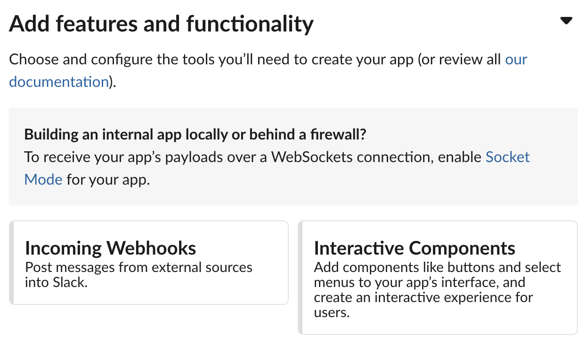
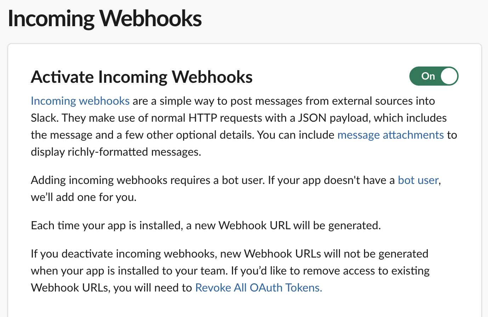
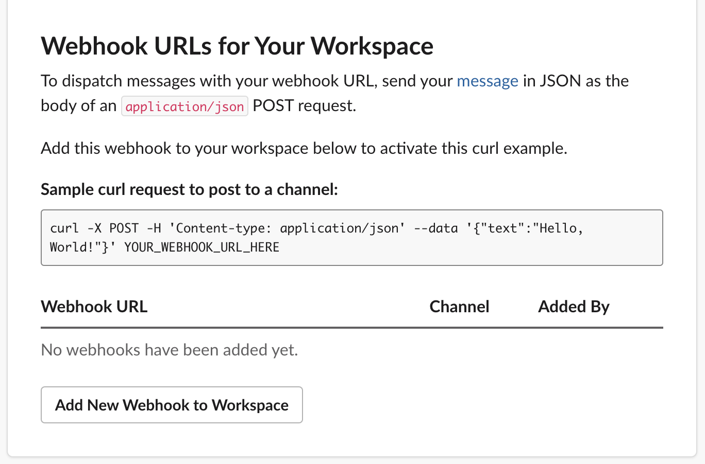
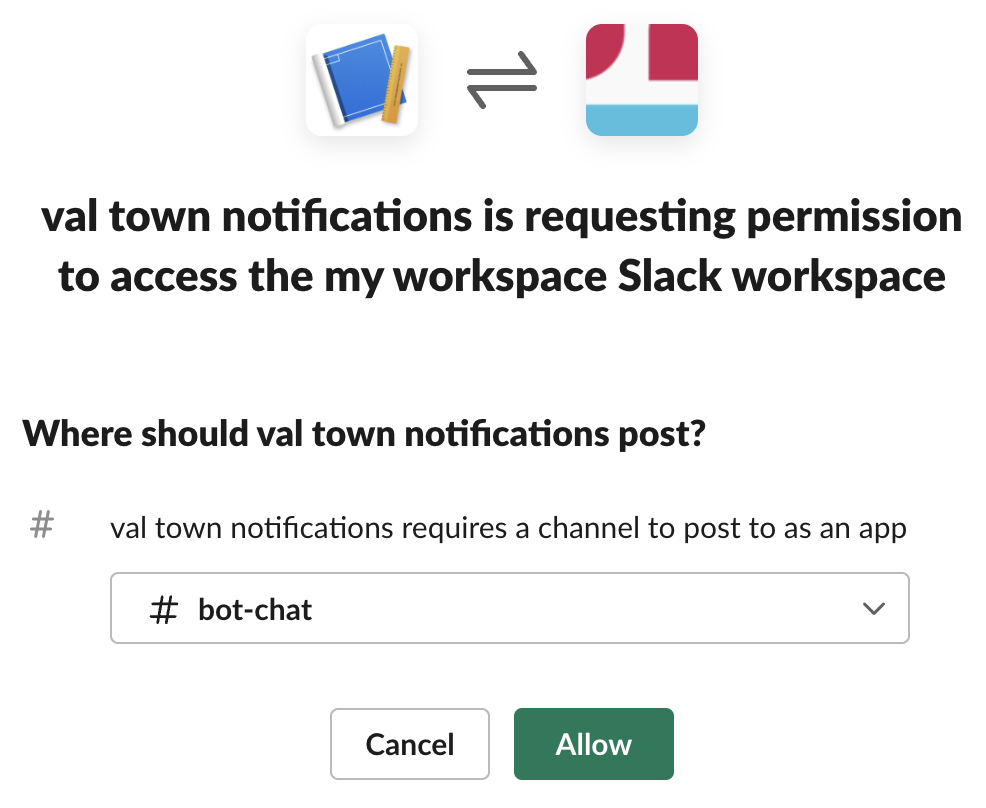
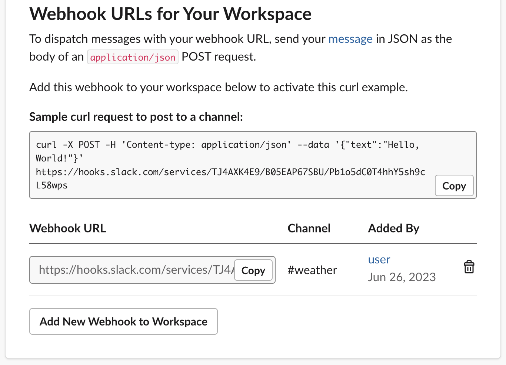
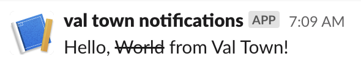

import Val from "@components/Val.astro";

You can send messages to Slack from vals.

In this guide you’ll create an incoming webhook for your Slack workspace, and
send a request to it with a message payload.

## Create a Slack app

Visit
[https://api.slack.com/apps?new_app=1](https://api.slack.com/apps?new_app=1),
create a new app **From Scratch**, and choose your **App Name** and your
workspace.

## Go to the incoming webhooks page

On the next page (or in the side bar), click **Incoming Webhooks**.

## Create an incoming webhook

Click the **Activate Incoming Webhooks** toggle.

Scroll down, and click **Add New Webhook to Workspace**.

Select the channel which the webhook will send messages to.

## Save the webhook address as a secret

You’ll be taken back to the **Incoming Webhooks** page (if not, you can find
it via the side bar).

Copy the **Webhook URL** for the webhook you just created and save it as a
[Val Town secret](https://www.val.town/settings/secrets) as `slackWebhookURL`.

## Use [fetch](https://developer.mozilla.org/en-US/docs/Web/API/Fetch_API) to send a message

Translate the sample cURL request to a
[fetch](https://developer.mozilla.org/en-US/docs/Web/API/Fetch_API) request. You
can copy and paste the following val.

<Val url="https://www.val.town/embed/vtdocs.slackWebHookMessageExample" />

If it worked, you will get a message in the channel you configured earlier!

Ran into a problem? Get help on the
[Val Town Discord](https://discord.gg/dHv45uN5RY).
