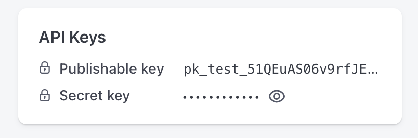
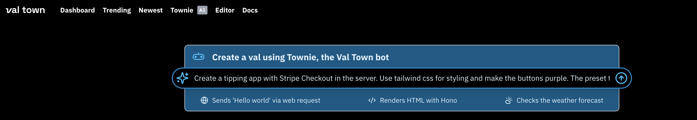

import Val from "@components/Val.astro";
import gif from './stripe/stripe-try-it-out.gif'

You can accept payments in Val Town with Stripe. This guide teaches you the simplest method: [Stripe Payment Links](https://stripe.com/payments/payment-links). Here's how it works:

1.  When users click to pay on your site, you redirect them to your stripe payment link
2. They pay with stripe
3. Stripe redirects them back to your site, where you can now store their payment information in a database, and thank them for their payment

## 1. Obtain credentials from the Stripe
Head over to the [Stripe dashboard](https://dashboard.stripe.com/dashboard) and get your secret key.



## Add Stripe to your environment variables
Go to your [Val Town environment varibales](https://www.val.town/settings/environment-variables) and add your secret key to Val Town.


## Ask Townie to generate our app

We can ask [Townie](https://www.val.town/townie), Val Town's bot, to generate our app for us. Here is an example prompt:

```
Create a tipping app with Stripe Checkout in the server. Use Tailwind CSS for 
styling and make the buttons purple. The preset tip options should 
be 1, 5, 10, 20.
```




## Try it out!
You can now use Stripe in Val Town! Also feel free to [fork](https://www.val.town/v/vawogbemi/StripeDemohttps://www.val.town/v/vawogbemi/StripeDemo) the val below to try it out.


<Val url="https://www.val.town/embed/vawogbemi/StripeDemo"/>