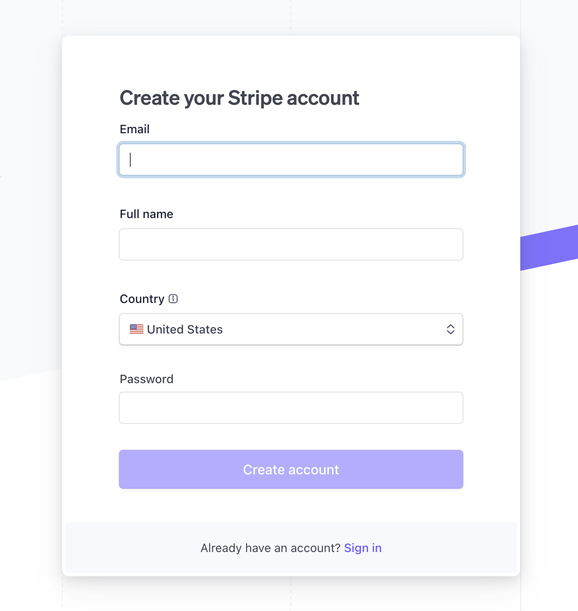
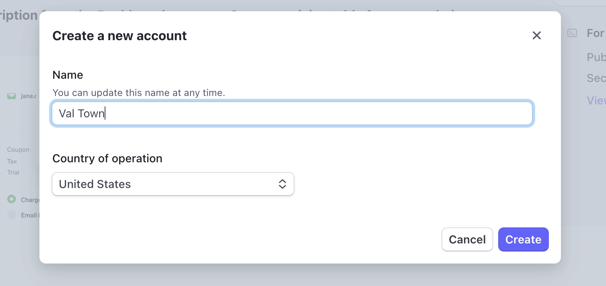
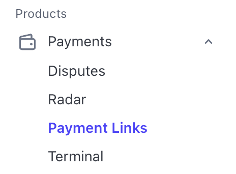
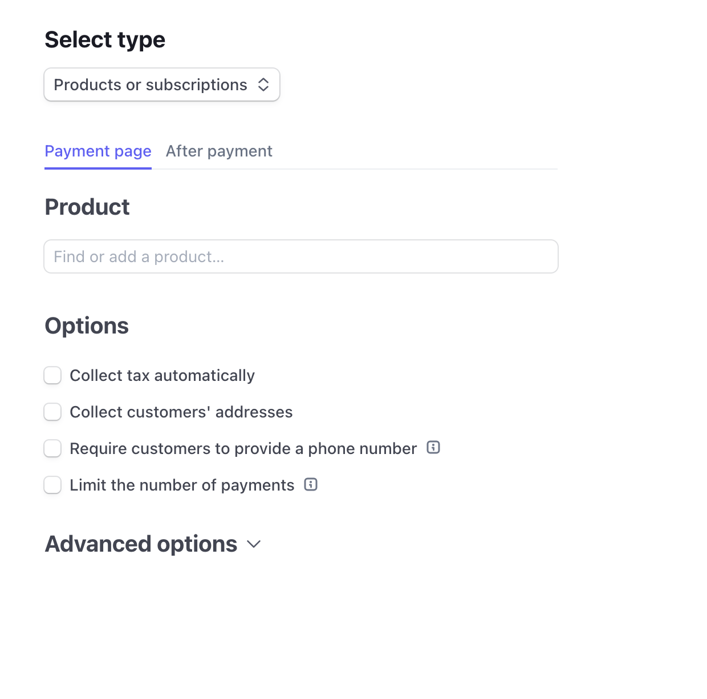

import Val from "@components/Val.astro";

You can accept payments in Val Town using Stripe.

## 1. Sign into your Stripe account

Visit [Stripe](https://dashboard.stripe.com/login) and sign into your account.

## 2. Create a new account

Create a new account for the app you're building.

## Examples

### Tip Jar (Payment Links)

## 3. Create a Payment Link for your app

Go to the Payment Links page by clicking the Payment Link link under the payments section in the menu on the left.

Once you're on the Paymment Links page click on the create new Payment Link button and fill out the fields.

## 4. Create a val that uses the Payment Link

Here is an example of a tip jar val that uses Stripe Payment Links. Fork this val and add your Stripe Payment Link. Feel free to customize the val to your preferences.

<Val url="https://www.val.town/embed/vawogbemi/stripeTippingDemo" />