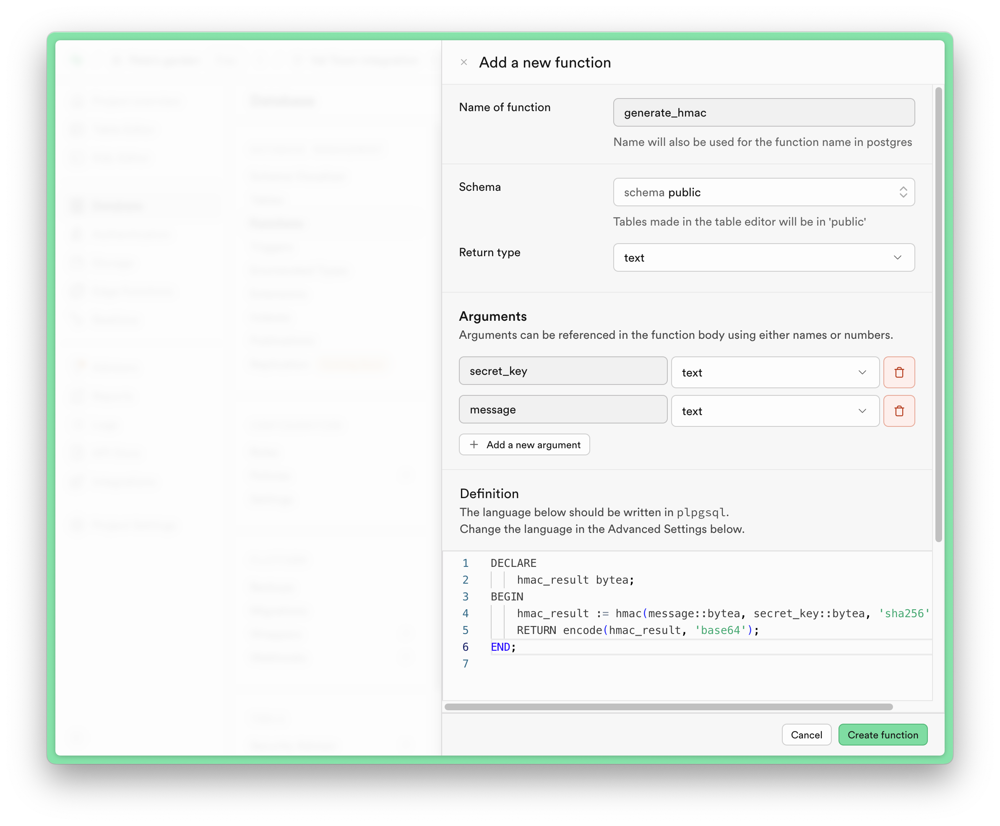
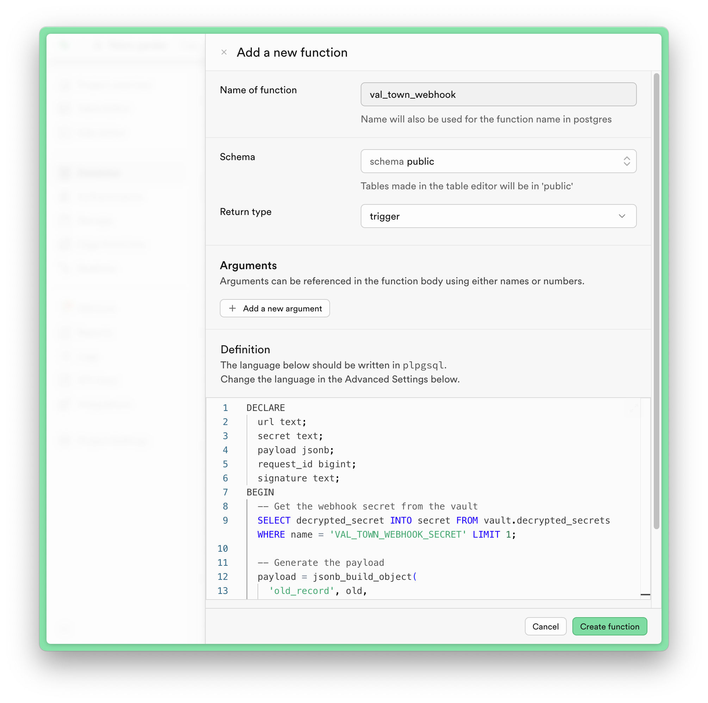
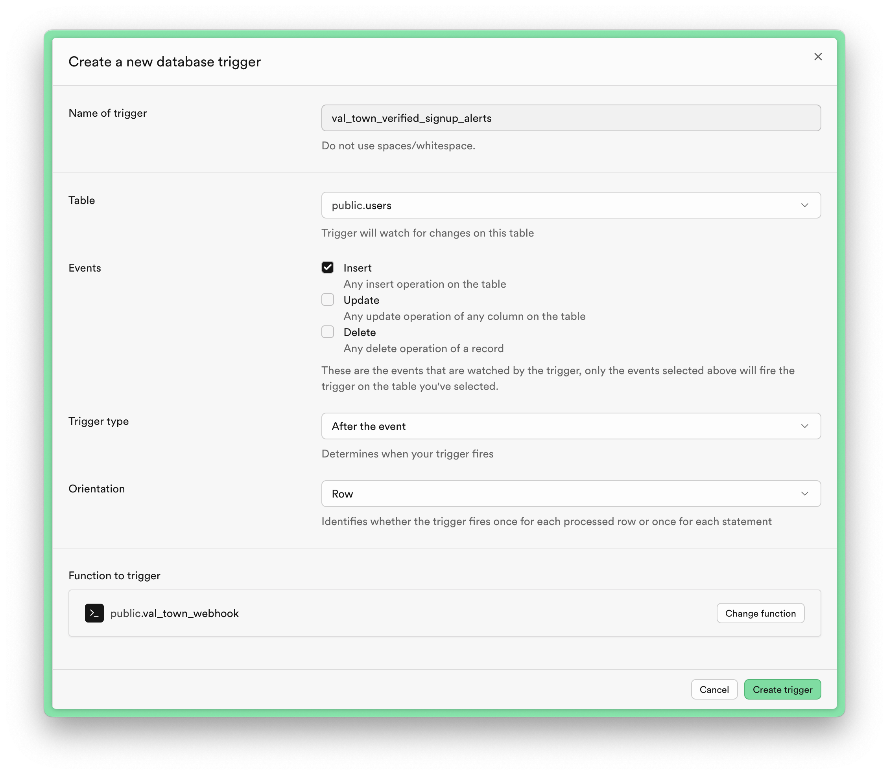

import Val from "@components/Val.astro";

Handling Supabase webhooks in Val Town allows you to run arbitrary logic whenever an `INSERT`, `UPDATE`, or `DELETE` happens in your database. For example, for new user signups you could set up an [email](/std/email), [Slack](/integrations/slack/send-messages-to-slack), or [Discord](/integrations/discord/send-message) notification, or [enrich user data with Clay](https://www.val.town/x/charmaine/clay-proxy).

## Create an HTTP trigger in Val Town

Create a new val using the webhook template, or remix this example val:

<Val url="https://www.val.town/embed/x/petermillspaugh/supabaseWebhook/main.ts" />

## Configure webhook(s) in Supabase

In your Supabase dashboard, navigate to Database > Webhooks in the sidebar and enable webhooks, which will install as an Integration:


To wire up your HTTP val:

1. Click "Create a new hook"
2. Name your webhook
3. Select what table (e.g. users) and events (e.g. INSERT) to hook into
4. Copy your val's HTTP endpoint and paste it in


You can reference Supabase's [database webhooks docs](https://supabase.com/docs/guides/database/webhooks) for more information about payloads, monitoring, and local development.

## Verify webhooks

Supabase does not include a signature header out of the box, but it's a good idea to verify that the webhook payload is coming from Supabase, which we can do by generating signatures ourselves.

1. Generate a high entropy secret key like `caffeinated-carpet-blunder-tournament` and add it both to your val's [environment variables](/reference/environment-variables/) and Supabase vault (Integrations > Vault):


2. In your Supabase dashboard, navigate to Database > Functions and create a function to generate a signature:



```sql
DECLARE
  hmac_result bytea;
BEGIN
  hmac_result := hmac(message::bytea, secret_key::bytea, 'sha256');
  RETURN encode(hmac_result, 'base64');
END;
```

3. Create another database function in Supabase to create the signed webhook:



```sql
DECLARE
  url text;
  secret text;
  payload jsonb;
  request_id bigint;
  signature text;
BEGIN
  -- Get the webhook secret from the vault
  SELECT decrypted_secret INTO secret FROM vault.decrypted_secrets WHERE name = 'VAL_TOWN_WEBHOOK_SECRET' LIMIT 1;

  -- Generate the payload
  payload = jsonb_build_object(
    'old_record', old,
    'record', new,
    'type', tg_op,
    'table', tg_table_name,
    'schema', tg_table_schema
  );

  -- Generate the signature
  signature = generate_hmac(secret, payload::text);

  -- Send the webhook request
  SELECT http_post
  INTO request_id
  FROM
    net.http_post(
      'https://TODO', -- 👋 Copy-paste your val's HTTP URL here!
      payload,
      '{}',
      jsonb_build_object(
        'Content-Type', 'application/json',
        'X-Supabase-Signature', signature
      ),
      '5000'
    );

  -- Insert the request ID into the Supabase hooks table
  INSERT INTO supabase_functions.hooks
    (hook_table_id, hook_name, request_id)
  VALUES (tg_relid, tg_name, request_id);

  RETURN new;
END;
```

4. In your Supabase dashboard, navigate to Database > Triggers and create a trigger to call the webhook function:



5. Verify the webhook signature in your val by copying or remixing this example:

<Val url="https://www.val.town/embed/x/petermillspaugh/supabaseVerifiedWebhook/main.ts" />
