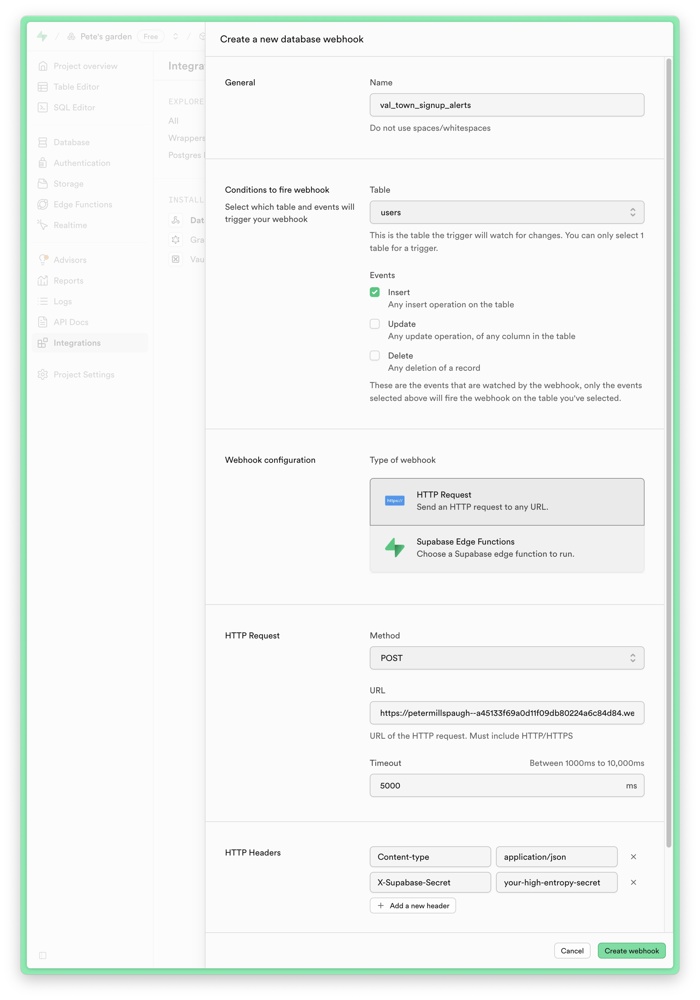

import Val from "@components/Val.astro";

Handling Supabase webhooks in Val Town allows you to run arbitrary logic whenever an `INSERT`, `UPDATE`, or `DELETE` happens in your database. For example, for new user signups you could set up an [email](/std/email), [Slack](/integrations/slack/send-messages-to-slack), or [Discord](/integrations/discord/send-message) notification, or [enrich user data with Clay](https://www.val.town/x/charmaine/clay-proxy).

## Create an HTTP trigger in Val Town

Create a new val using the webhook template, or remix this example val:

<Val url="https://www.val.town/embed/x/petermillspaugh/supabaseWebhook/main.ts" />

## Configure webhook(s) in Supabase

Enable [Database > Webhooks](https://supabase.com/dashboard/project/_/integrations/webhooks/webhooks) in the Supabase dashboard, which will install as an Integration:

To wire up your HTTP val:

1. Click "Create a new hook"
2. Name your webhook
3. Select what table (e.g. users) and events (e.g. INSERT) to hook into
4. Copy your val's HTTP endpoint and paste it in
5. Create a [random secret](https://randomkeygen.com) and add it as a header

6. Store the secret as an [environment variable](/reference/environment-variables/) in your val

Reference Supabase's [database webhooks docs](https://supabase.com/docs/guides/database/webhooks) for more information about payloads, monitoring, and local development.

## Verify webhooks

The hard-coded secret we added above is quick but imperfect security. For more robust signature verification, you can reference [this `supabaseVerifiedWebhook` val](https://www.val.town/x/petermillspaugh/supabaseVerifiedWebhook).
