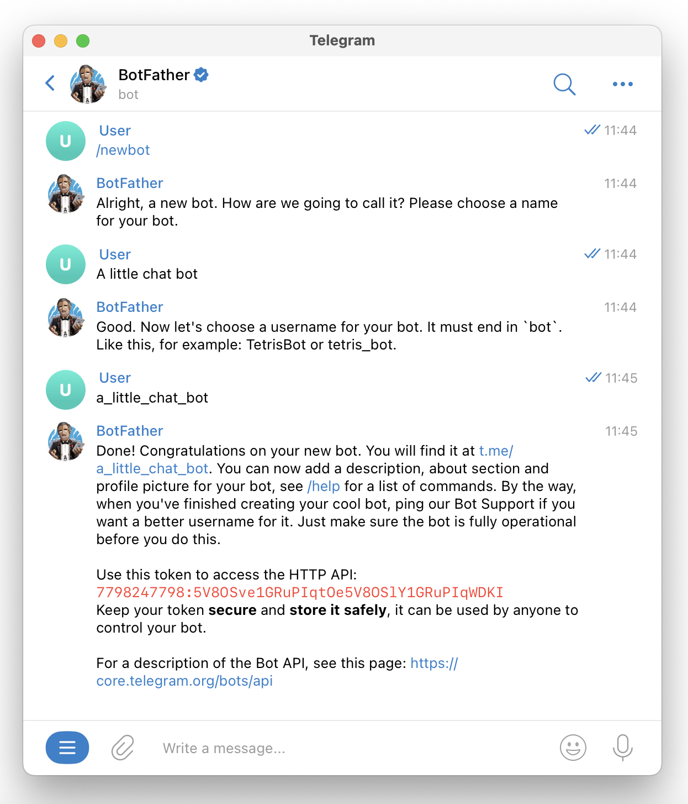
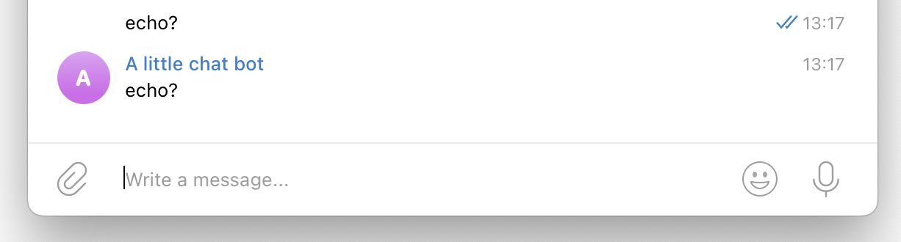

You can create Telegram bots using vals.

In this example, you'll create a val that uses the [HTTP Val](/types/http) to
receive webhooks from Telegram.

When users message your bot, the bot will reply with the same message.

### Create your bot by talking to `@BotFather`

Speak to Telegram's [https://t.me/botfather](https://t.me/botfather) to create
your bot and obtain a bot token.



### Add the bot token as an environment variable

Copy the bot token you just received and save it as a Val Town environment variable as
`telegramBotToken`.

### Check your token works

Call `@vtdocs.telegramGetMe` with your newly created environment variable to check that it
works.

```ts title="Check token" val
import { telegramGetMe } from "https://esm.town/v/vtdocs/telegramGetMe";

console.log(await telegramGetMe(Deno.env.get("telegramBotToken")));
```

### Create an environment variable so you can verify webhooks

Generate a random string and save it as a Val Town environment variable as
`telegramWebhookSecret`.

### Create a webhook handler to receive messages

When Telegram users send messages to your bot, they will be forwarded to your
webhook handler. We'll use the environment variable we just created to verify that the message
came from our bot.

Copy this val that uses the [HTTP Val](/types/http) :

```ts title="Webhook handler" val
import { telegramSendMessage } from "https://esm.town/v/vtdocs/telegramSendMessage?v=5";

export const telegramWebhookEchoMessage = async (req: Request) => {
  // Verify this webhook came from our bot
  if (
    req.headers.get("x-telegram-bot-api-secret-token") !==
      Deno.env.get("telegramWebhookSecret")
  ) {
    return new Response(undefined, { status: 401 });
  }
  // Echo back the user's message
  const body = await req.json();
  const text: string = body.message.text;
  const chatId: number = body.message.chat.id;
  await telegramSendMessage(
    Deno.env.get("telegramBotToken"),
    { chat_id: chatId, text },
  );
  return Response.json("ok");
};
```

### Tell your bot about the webhook handler

Use `@vtdocs.telegramSetWebhook` to tell your bot where to send webhooks.

```ts title="Register webhook" val
import { telegramSetWebhook } from "https://esm.town/v/vtdocs/telegramSetWebhook?v=2";

const token = Deno.env.get("telegramBotToken");
export const setWebhookExample = telegramSetWebhook(
  token,
  {
    // Replace this with _your_ web endpoint
    url: "https://neverstew-telegramWebhookEchoMessage.web.val.run",
    // Optionally, filter what kind of updates you want to receive here
    allowed_updates: ["message"],
    secret_token: token,
  }
);
```

### Send a message to your bot to check it works!

It should echo back the message like this:



Not working? Try debugging the webhook handler you created via the
[Evaluations tab](https://www.val.town/settings/evaluations). Or get help on Val
Town's [Discord](https://discord.gg/dHv45uN5RY).
