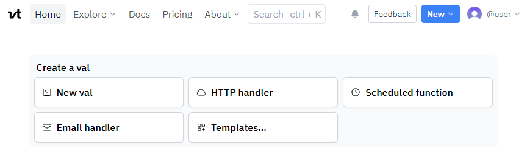
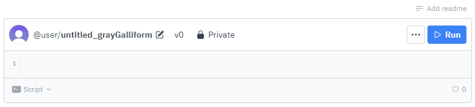
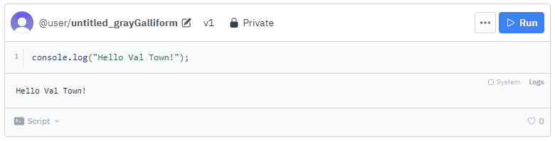
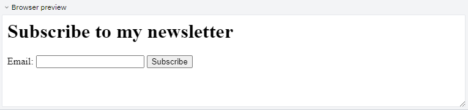
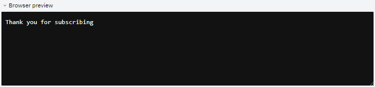
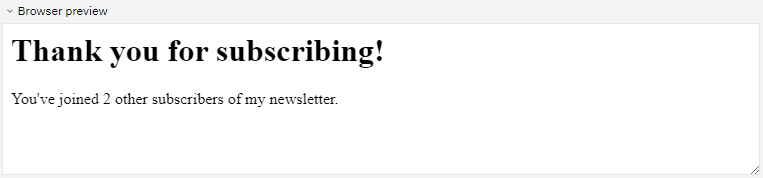

Welcome to Val Town! This guide will walk you through the basics of writing vals - snippets of code that are the building blocks of Val Town. We will build a simple web page that allows visitors to subscribe to your newsletter. The website will be composed of multiple vals so that we can demonstrate how they can be used together.

:::note

If you're an experienced JavaScript/TypeScript developer, a lot of the concepts explained in this guide will be very familiar to you. Val Town strives to follow the web standards as much as possible, so you can expect most of the Deno conventions to work in Val Town. Feel free to explore the rest of the docs to get more cut-and-dry explanations of how things work in Val Town.

:::

## What is a val?

A val is a snippet of JavaScript/TypeScript code that can be executed in various ways:

- Manually by clicking the **Run** button
- Scheduled to run at a specific time or interval
- Used by other vals
- Triggered by an email
- Triggered by an HTTP request (it can even respond to it)

In this introduction we will focus on running the val manually and using it in other vals.

## Creating your first val

When you log in to Val Town, no matter if it's your fist or hutredth time, you'll be greeted with the menu at the top of the page and a **Create a val** section right below it:



To create a new val, click the **New val** button in the **Create a val** section. This will create a brand new val with no code in it.



Let's take a moment to get familiar with it's interface.

At the top of a val you can see:

- The author of the val (**@user**) and it's avatar. In will be your username. You can click on the avatar to go to the author's profile.
- Name of the val - randomly generated (**untitled_grayGalliform**). Here it's `untitled_grayGalliform`. If you click on the name of the val it will take you to a separate page where only that val is displayed. On that page you (and others) can comment on it.
- Button to change the name of the val.
- Number identifying the currently displayed version of the val. Before val is executed/saved it's **v0**.
- The permissions of the val - by default every val is **🔒 Private**.

Additionally when you hover over the val you will see:

- `···` options button - allows to you access val's menu.
- **Run** button - in some cases it might be replaced by a **Save** button.
- **Add readme** above the **Run** button - allows for adding a short description/documentation to the val.

Under the top section of the val you can see the code editor. For now it contains only a single empty line numbered `1`. This is where we will write our code.

On the bottom of the val there is a status bar showing:

- **Script** - the type of the val. You can change it by clicking on it, but let's leave it at **Script** for now.
- To the right you can see how many people liked your val (♥️) and how many times it's been referenced by other vals (@).
- Some other types of vals might also display **Logs** button that will take you to the val's execution logs.

## Running code manually

It's about time to write some code! Let's start out with the a simple "Hello Val Town" example. Type the following code into the code editor of your val:

```ts val
console.log("Hello Val Town!");
```

You should notice that as you're typing, the editor is giving you some hints, just like some other editors you might have used. This may be very helpful, especially when using other vals in your code.

When you're done typing, click the **Run** button in the top right corner of the val. This will execute the code in the val and display the console output.



There it is! Under the code editor you can see the console output of the val saying `Hello Val Town!`. Congratulations! You've just created and executed your first val!

As you can see the version of the val has changed to **v1**. This is because every time you run a val after making a code change, the val is saved as a new version. This allows for a stress-free experimentation and testing of your code. You can always go back to a previous version of the val if you need to simply by clicking the current version indicator and selecting a different one from a list.

## Building a newsletter subscription page

Now that we know how to run a val, let's do take a first step to build our newsletter subscription page. We can start with a val that will store the HTML. Create a new empty val with the **New val** button, rename it to `newsletterHtml` and type the following code into it:

```ts title="@user/newsletterHtml" val
export const pageContent = `
<h1>Subscribe to my newsletter</h1>
<form action="/" method="post">
  <label for="email">Email:</label>
  <input type="email" id="email" name="email" required>
  <button type="submit">Subscribe</button>
</form>`;
```

:::note

You can also click the **Run in Val Town** button on the top right corder of the code block above automatically copy the code and create a new val in a new tab. Just be aware that the val won't be saved until you click the **Run** button. It will also get a random name assigned to is to you will need to rename it yourself.

:::

This val uses the keyword `export` to return a single value - `pageContent`. This value is a string containing the HTML of the newsletter subscription page. When you **Run** it for the first time, it will save and calculate the exported values. Can see our exported value in the **Exports** section below the code editor:

```txt title="Exports"
Object {
  "pageContent":"\n<h1>Subscribe to my newsletter</h1>\n<form action=\"/\" method=\"post\">\n  <label for=\"email\">Email:</label>\n  <input type=\"email\" id=\"email\" name=\"email\" required>\n  <button type=\"submit\">Subscribe</button>\n</form>"
}
```

The HTML content is rather straightforward. It's a form with a single input field for the email address and a submit button. The form is submitted to the root of the website (`/`) using the `post` method which we will use later to handle the form submission.

Now that we exported a value let's use it in another val.

## Building an API

Besides simply executing code when you click **Run**, Val Town also allows you to create HTTP APIs that are automatically hosted on the web. This means then your code will run whenever someone makes a request to the URL associated with your val. Let's create a val that will return the HTML of our newsletter subscription page.

This time we will create a val from a template. Click the **Templates..** button in the **Create a val** section. This will open up a list of available templates. Scroll fown to **Web apps\* section and click **HTTP server with Hono\*\*. This will create a new val with some code in it:

```ts val
import { Hono } from "npm:hono@3";

const app = new Hono();
app.get("/", (c) => c.text("Hello world!"));
app.get("/yeah", (c) => c.text("Routing!"));
export default app.fetch;
```

Let's take a moment to understand what's going on here. The first line imports the `Hono` class from the [`hono` NPM package](https://hono.dev/). You can import pretty much any NPM package that is compatible with Deno runtime and use it in your val. The [Hono framework](https://hono.dev/) allows for a quick and simple way of building HTTP APIs.

Next we're creating a new instance of the `Hono` class. We can use that instance to configure our API. The template comes with two routes configured:

- `GET /` - returns a simple text response saying "Hello world!"
- `GET /yeah` - returns a simple text response saying "Routing!"

The last line of the val exports the `fetch` method of the `app` instance. This method is used by Val Town to handle incoming HTTP requests. Notice that we're using the `export default` syntax. The [**HTTP** val](/types/http) expects a function that can accept a `Request` as a default export. The `fetch` method of the `app` instance is exactly that.

Notice that this val looks a little bit different that the [Script vals](/types/script) that we dealt with so far:

- The **type of the val** was automatically set by the template to **HTTP**. You can see it in the bottom left corner of the val.
- Because it's an HTTP val, there is a **Browser preview** under the code editor. This preview shows you the preview of the website that will be served by the val. It's sowing `Hello world!` because that's what the `/` route returns.
- On the right of the val type you can see the **URL of the val** that the API is exposed on. There are buttons for copying the URL and opening it in a new tab. You can also click the URL itself to open it in a new tab.
- The **val's permissions** were automatically set to **🔗 Unlisted**. Be aware of that. Anyone with the URL (your username and the name of the val) can view the code of this val and send HTTP requests to it. If the val was set to **🔒 Private** you would need to authenticate your requests with your Val Town API Token, which is not useful in our case - we want anyone to be able to subscribe to our newsletter.
- Instead of **Run** button there is a **Save** button simply to save the code changes. This is because the HTTP val runs automatically whenever someone makes a request to it's URL.

Let's rename the val to `newsletter` - this will also change the URL of the val. Now we can change the code of the val to return the HTML of our newsletter subscription page. Replace the code of the val with the following:

```ts title="@user/newsletter" {1-2,7-9} val
// Please make sure to replace @user with your username.
import { pageContent } from "https://esm.town/v/user/newsletterHtml";
import { Hono } from "npm:hono@3";

const app = new Hono();

app.get("/", async (c) => {
  return c.html(pageContent);
});

export default app.fetch;
```

In the first line we import the `pageContent` value from the `newsletterHtml` val that we created and exported earlier. This is how we can use one val in another.

:::note

When writing your code you don't have to write imports of other vals manually. Whenever you type **@** you can start typing the username, val name or even a name of an exported variable and Val Town will search through yours and other public vals to find the one you're looking for. You can then select it from the list by clicking it or pressing **Tab** on your keyboard. Val Town will then automatically insert the import statement for you.

:::

Then we replaced the existing `GET` endpoints with a single `GET /` endpoint that returns the `pageContent` value from our val as HTML. After pressing **Save** the browser preview should update to show the newsletter subscription page:



## Receiving user data

Now that we have a newsletter subscription page, we need to be able to receive the data from the form. Our HTML page content specifies that when user presses the **Subscribe** button, the form data will be sent to `/` via `POST` HTTP request. Let's add an endpoint to our `newsletter` val that will handle the form submission:

```ts title="@user/newsletter" {10-21} val
import { pageContent } from "https://esm.town/v/user/newsletterHtml";
import { Hono } from "npm:hono@3";

const app = new Hono();

app.get("/", async (c) => {
  return c.html(pageContent);
});

app.post("/", async (c) => {
  const formData = await c.req.formData();
  const email = formData.get("email");

  if (typeof email !== "string" || !email) {
    // Respond with an error message
    return c.text("Please provide a valid email address.", 400);
  }

  // Respond with a confirmation message
  return c.text("Thank you for subscribing");
});

export default app.fetch;
```

Here we added a new `POST /` endpoint that will extracts the email address from the form data and responds with a simple confirmation message. We also added a check to make sure that the email address is valid. If it's not, we respond with an error message. After saving the val and submitting an email in the browser preview you should see the confirmation message:



But we didn't really save that email address anywhere. Fortunately Val Town comes with tools that will fix that problem in no time.

## Storing emails

In Val Time you have several options for storing data easily. The most used ones are:

- [Blob storage](/std/blob) - a simple key-value store that allows you to store any data you want - JSON, pictures, soudns... It's great for storing small amounts of data that you want to access quickly.
- [SQLite database](/std/sqlite) - a relational database that is shared between all your vals. It's great for storing large amounts of data with specific structure that you want to query efficiently.

In our case the simplicity is the key, so we will use the blob storage. We can store a list of emails as a JSON array in a single blob. Create a new empty val by clicking the **New val** button and rename it to `newsletterData`. Then type the following code into it:

```ts title="@user/newsletterData" val
import { blob } from "https://esm.town/v/std/blob";

const subscribersKey = "newsletter:subscribers";

export async function addSubscriber(email) {
  const subscribers = ((await blob.getJSON(subscribersKey)) ?? []) as string[];
  const isSubscribedAlready = subscribers.filter((s) => s === email).length > 0;
  if (!isSubscribedAlready) {
    subscribers.push(email);
    await blob.setJSON(subscribersKey, subscribers);
  }
}
```

Let's go through the code to make sure we understand everything properly.

First we import the [`blob` val](/std/blob). Val Town comes with a set of standard vals that are always available to you. We refer to them as the **Standard Library**. The `blob` val allows you to interact with blob storage by using simple `getJSON` and `setJSON` methods.

To read or write data in blob storage, we need to specify a key. It's a string that uniquely identifies the data. In our case we will use `newsletter:subscribers` as the key set to the `subscribersKey` variable.

Then we export a function called `addSubscriber`. Exporting a function instead of a value allows other vals to use it and call it with different parameters, multiple times, etc. The function accepts a single parameter - `email`. Our API will be able to call this function to add a new subscriber to the list.

Inside our function first we're reading the current list of subscribers from the blob storage. We're using the `getJSON` method to read the data and then we're casting it to a string array. If there is no data in the blob storage yet, we're using the `??` operator to set the value to an empty array.

Then we're checking if the email address is already on the list. If it's not, we're adding it to the list and saving the updated list back to the blob storage. Saving the data is as simple as calling the `setJSON` method with the key and the data.

This val should allow us to easily save the email addresses of our subscribers and make sure there are no duplicates. Nobody likes getting the same email twice.

Now that we have means to store the emails, let's use it in our `newsletter` val. Update the code of the `newsletter` val by importing the `addSubscriber` function from the `newsletterData` val:

```ts {1}
import { addSubscriber } from "https://esm.town/v/user/newsletterData";
import { pageContent } from "https://esm.town/v/user/newsletterHtml";
import { Hono } from "npm:hono@3";
```

And then using it in the `POST /` endpoint:

```ts {10-11}
app.post("/", async (c) => {
  const formData = await c.req.formData();
  const email = formData.get("email");

  if (typeof email !== "string" || !email) {
    // Respond with an error message
    return c.text("Please provide a valid email address.", 400);
  }

  // Store the email address using blob
  await addSubscriber(email);

  // Respond with a confirmation message
  return c.text("Thank you for subscribing");
});
```

Every time somebody submits the form, the `newsletter` val will call the `addSubscriber` function from the `newsletterData` val to store the email address. The list will only grow from now on!

## A nicer thank you page

Let's make the confirmation page a little bit nicer than a single line of tiny text. Let's make it so that we tell the user how many people are already subscribed to our newsletter. Let's start by updating our `newsletterHtml` val to export an additional function:

```ts title="@user/newsletterHtml" {9-15} val
export const pageContent = `
<h1>Subscribe to my newsletter</h1>
<form action="/" method="post">
  <label for="email">Email:</label>
  <input type="email" id="email" name="email" required>
  <button type="submit">Subscribe</button>
</form>`;

export function getThankYouContent(subscribersCount: number) {
  let html = `
<h1>Thank you for subscribing!</h2>
You've joined {{NUMBER}} other subscribers of my newsletter.`;
  html = html.replace("{{NUMBER}}", `${subscribersCount - 1}`);
  return html;
}
```

The `getThankYouContent` function accepts a single parameter - `subscribersCount` and returns a string containing the HTML of the thank you page. Notice that we're using the `{{NUMBER}}` placeholder in the HTML string that gets replaced with the actual number of subscribers. This way our thank you page will be always up to date.

:::note

A val can export multiple values and functions. You can mix then in any way you want - this is the standard JavaScript/TypeScript behavior.

:::

Now that we need the number of subscribers, let's update the `newsletterData` val to export a function that will return such value. Add the folowing function to the `newsletterData` val:

```ts title="@user/newsletterData" {14-17} val
import { blob } from "https://esm.town/v/std/blob";

const subscribersKey = "newsletter:subscribers";

export async function addSubscriber(email) {
  const subscribers = ((await blob.getJSON(subscribersKey)) ?? []) as string[];
  const isSubscribedAlready = subscribers.filter((s) => s === email).length > 0;
  if (!isSubscribedAlready) {
    subscribers.push(email);
    await blob.setJSON(subscribersKey, subscribers);
  }
}

export async function getSubscriberCount() {
  const subscribers = (await blob.getJSON(subscribersKey)) as string[];
  return subscribers.length;
}
```

Remember to **Save** the `newsletterData` val to save the changes.

And finally we need to update our `newsletter` val to use the new functions. Update the code of the `newsletter` val by importing the `getThankYouContent` and `getSubscriberCount` functions from the `newsletterHtml` val and then using them in the `POST /` endpoint:

```ts title="@user/newsletter" {1-2,24-25} val
import { addSubscriber, getSubscriberCount } from "https://esm.town/v/user/newsletterData";
import { getThankYouContent, pageContent } from "https://esm.town/v/user/newsletterHtml";
import { Hono } from "npm:hono@3";

const app = new Hono();

app.get("/", async (c) => {
  return c.html(pageContent);
});

app.post("/", async (c) => {
  const formData = await c.req.formData();
  const email = formData.get("email");

  if (typeof email !== "string" || !email) {
    // Respond with an error message
    return c.text("Please provide a valid email address.", 400);
  }

  // Store the email address using blob
  await addSubscriber(email);

  // Respond with a confirmation message
  const count = await getSubscriberCount();
  return c.html(getThankYouContent(count));
});

export default app.fetch;
```

We can import muliple values and functions from a single val by separating their names with a comma. Then before responding to the request we're calling the `getSubscriberCount` function to get the number of subscribers and passing it to the `getThankYouContent` function to get the HTML of the thank you page. Save it and try submitting the form again. You should see the updated thank you page:



## Conclusion

We hope this guide helped you get started with Val Town. You've learned how to:
- Create a new val
- Run a val
- Use vals in other vals
- Create an HTTP API
- Use blob storage to store data

Now that you know the basics, you can start building your own projects. You can also expand on the newsletter subscription page by adding more features:

- Email yourself about new subscribers using the [email val](/std/email) from the Standard Library.
- Use the `newsletterData` val to use the list of subscribers in other vals.
- Add a way to unsubscribe from the newsletter.

If you have any questions, feel free to ask them on the [Val Town Discord server](https://discord.gg/3Xj6gJj). We're always happy to help!

## Cleaning up

During this guide we've added some data to the blob storage. If you want to clean it up, you can do so by deleting the `newsletter:subscribers` key. You can do it by running the follownig val:

```ts title="Delete subscribers list" val
import { blob } from "https://esm.town/v/std/blob";
blob.delete("newsletter:subscribers");
```
