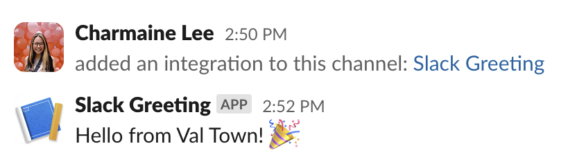
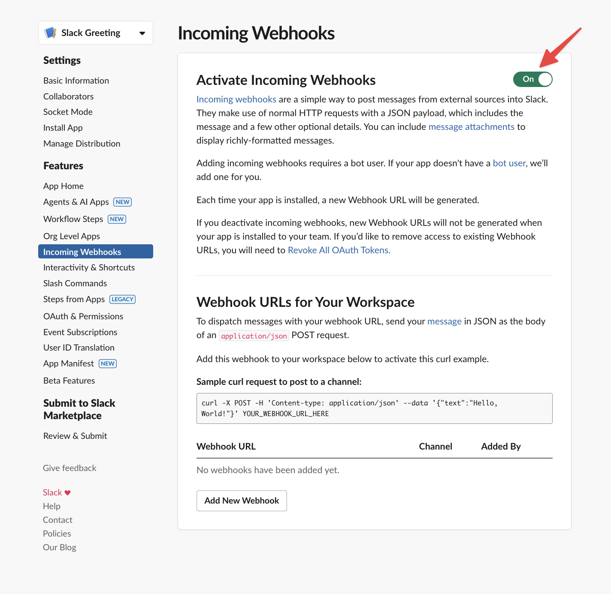
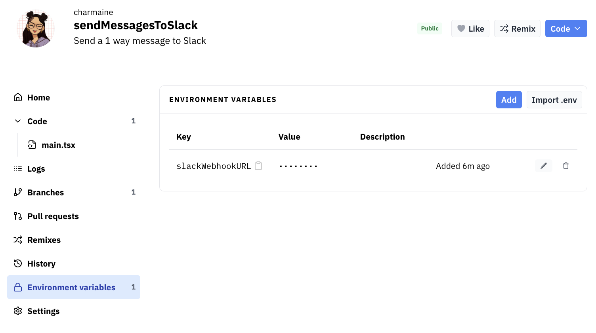

import { LinkButton } from "@astrojs/starlight/components";

Val Town is the easiest way to self-host a Slack app - everything is configured on the web with no local development required. It's free and easily shareable.

You can send one-way Slack messages as a Slack app in minutes on Val Town. 

<LinkButton
  href="https://api.slack.com/messaging/webhooks"
  variant="secondary"
  icon="external"
  iconPlacement="start"
>
  Docs: Slack Incoming Webhooks
</LinkButton>

<LinkButton
  href="https://api.slack.com/apps?new_app=1"
  variant="secondary"
  icon="external"
  iconPlacement="start"
>
  Create a Slack App
</LinkButton>

Copy the snippet below into a new val and set the `slackWebhookURL` environment variable to your Slack app's webhook URL - or skip the setup and [remix this ready-made example](https://www.val.town/x/charmaine/sendMessagesToSlack/). 

```ts title="Send message" val
const res = await fetch(process.env.slackWebhookURL, {
  method: "POST",
  body: JSON.stringify({
    text: `Hello from Val Town! 🎉`,
  }),
});
console.log(res.statusText);
```

This posts a greeting to any Slack channel of your choice.




## Get your webhook URL

**Create a Slack app:**
1. Go to [Slack API](https://api.slack.com/apps?new_app=1) and create a new app **From Scratch**
2. Choose an **App Name** and select your workspace


**Enable incoming webhooks:**
1. Go to **Features → Incoming Webhooks**
2. Toggle **Activate Incoming Webhooks**



**Create webhook:**
1. Click **Add New Webhook**
2. Select your target channel

**Add to Val Town:**
1. Copy the **Webhook URL** from Slack
2. In your val's sidebar: **Environment Variable** → set **slackWebhookURL**



You will get a Slack message every time you click `Run` on the `main.tsx` file. 


## What's next?

Take this a step further by responding to mentions, slash commands, buttons, and other user interactions with our full [Slack bot guide](/integrations/slack)!

You can find more Slack examples on our [Templates page](https://www.val.town/explore/use-cases).