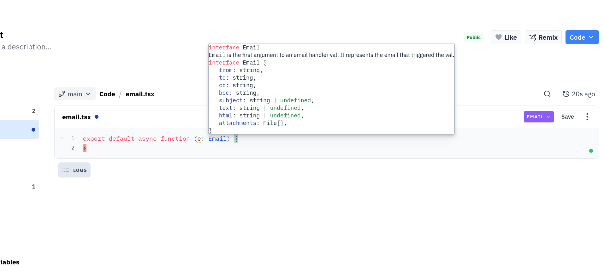

To provide the best possible editor experience, Val Town runs the real [deno language server](https://docs.deno.com/runtime/reference/lsp_integration/) (LSP) in our code editor.

A "language server" is a program that most languages, including TypeScript, provide to enrich your editing experience, providing things like code diagnostics (such as red squiggles for broken code), hover overs, and "go to definition" capabilities.

At Val Town, we run `Deno`, which is a modern TypeScript runtime with unique features like URL import support and the `Deno` global. You may have noticed this when querying environment variables with `Deno.env.get`. `Deno` is unique enough from regular TypeScript that it provides its own [language server](https://docs.deno.com/runtime/reference/lsp_integration/).

When you load our editor, you will see a small colored dot in the bottom right. This is the language server status indicator. We run language servers on containers in the cloud, and each user gets their own LSP container. This dot indicates your connection state to your LSP container. You can click on it for a dropdown with more information.

We attempt to pre-warm a server for you when you load Val Town so that the LSP is quickly ready when you get to our editor, but sometimes the LSP can take a while to boot (in rare cases, up to 15-20 seconds), typically after using it for the first time in a while. This is normal, and after it loads it will stay warm until a little while after you close the editor.

This dot has 5 ready states:

- **Disconnected**: The LSP is disconnected. If you are ever in this state, try restarting the LSP. Usually we will attempt to automatically do the restart for you if you ever each this state.
- **Connecting**: You are attempting to establish a websocket connect to the LSP. The container may currently still be booting, so you could be stuck in this state for a while if you are using the LSP for the first time in a while.
- **Restarting**: You triggered a restart, and the LSP is in the process of dying.
- **Waiting**: The LSP is connected, and is currently loading your Val and downloading its dependencies. The LSP will be functional in this state but its functionality will be degraded -- you may see "unresolved import" errors, for example, as it attempts to download them.
- **Healthy**: The LSP has done a "handshake" with the editor and cached all of your Val's dependencies. It's ready to go!

We reload the LSP when you load a different Val, or a different branch of the same Val. Currently we only let you run one instance of the LSP at a time. This means that if you are editing some val A, and you open a new tab and begin to edit some val B, tab A will change to "Disconnected" state. When you focus (click) in the editor in tab A again, we will automatically disconnect tab B and reconnect for tab A.

Right now, the language server is only active for Vals that you own when you are interacting with a _non_-read-only editor. This may change in the future.

Right now the LSP is a **beta experience**, and it is possible you may experience bugs. Please reach out if something isn't working as expected, or if you experience random crashes!

#### Features

The LSP experience you will find in our editor is very similar to that of using the Deno LSP locally, but we have added some platform specific additional functionality, like adding environment variable suggestions when you type "Deno.env...", or cautioning you about using jsx in a .ts file.

Language servers have a large amount of features. We support the following subset of the LSP specification:

- Diagnostics (red, yellow, and gray squiggles)
- Completions (the list of suggestions that pop up as you type)
- Code actions (buttons that show up when you hover on yellow squiggles)
- Hover overs
- Go to definition (when you command or control click on a symbol, or press F12 while focused on a symbol)
- Signature reference (a box indicating the arguments a function takes that shows up when you are typing a function invocation)

`Deno` supports a top level [`deno.json`](https://docs.deno.com/runtime/fundamentals/configuration/) file to configure Deno. This is like an all in one `package.json`, `tsconfig.json` and `.eslintrc.js`. If you have a `deno.json` present at the top level of your Val, we will attempt to give the LSP access to it. You may have to restart the LSP after changing it. We suggest you restrict editing of the `deno.json` to the `lint` and `compilerOptions` fields to configure how the LSP works, since we do not currently support running your code with a custom `deno.json`.

#### Formatting

In your editor settings, you can opt in to automatic formatting on save. When you save a file in your Val, it will have the [Deno formatter](https://docs.deno.com/runtime/reference/cli/fmt/) invoked.

You can customize format settings by visiting your editor settings and changing your "Deno fmt" options. This is equivalent to the `"fmt":` field in the `deno.json`. These settings are scoped across your entire account. Currently we do not support the `fmt` field in a `deno.json` for a Val.

For all the format options, [visit this page of `Deno`'s docs](https://docs.deno.com/runtime/fundamentals/linting_and_formatting/).

#### Multi Tab Editing

When editing the same Val, we support multi-tab editing. Just like your local editor would, we share the same LSP process across all files for the same Val, and if you have multiple tabs open, they all talk to the same instance of the deno LSP. If you, for example, make a change to the return type of a function in one tab, and you have a file open in another tab that imports and uses that function, that tab may see red squiggles pop up.

One caveat of multi tab editing is that if you attempt to edit the same file in multiple tabs, you will see the same diagnostics across all tabs, even though the current content state of the same file across tabs may differ. We suggest you do not edit the same file in multiple tabs.

#### Restarting the Language Server

Language servers are complicated and delicate. It is possible that the internal state of the language server falls out of sync, and it thinks that your files are slightly different than they actually are. In a situation like this, you may see confusing red squiggles all over the place, code actions that make no sense, or other unexpected behavior.

If you run into a situation where you think the LSP is in a "bad state," you can restart it by clicking the tiny dot in the bottom right, and pressing "Restart." The restart button will kill and respawn the Deno LSP so that it has a clean slate.

We also provide a "Hard Restart" button. This totally shuts down and reboots the entire container (server) that is running the LSP process. You should generally avoid using this unless the LSP is not responding and the Restart button is ineffective. A Hard restart can take up to 15-20 seconds to complete. A regular restart should be very quick.

#### How does this all work?

The Deno language server is part of `Deno`. If you have `deno` installed on your computer, you can actually run `deno lsp` to start the LSP. You won't see anything though, since you have to send special messages to and from the process to "activate" it, which is something your editor (such as vscode, for example) usually does.

To expose the Deno language server to the Val Town editor, we run instances of the Deno LSP on [cloudflare containers](https://developers.cloudflare.com/containers/). The [LSP protocol](https://microsoft.github.io/language-server-protocol/) is relatively straightforward and consists of JSON payloads sent to and from the LSP, like

`{"jsonrpc":"2.0","method":"textDocument/didOpen","params":{"textDocument":{"uri":"file:///path/to/file.ts","languageId":"typescript","version":1,"text":"console.log('hello world!')"}}}`

We serialize and send messages to and from this container over a WebSocket connection to talk to the language server. If you're curious, you can open your browser's network tab and press the LSP "Restart" button, and you will see a Websocket connection be established to `lsp.val.town`, and you can watch the actual LSP messages go back and forth. These messages received from the LSP are transformed in to UI components in our editor, and various editing actions will cause messages to get sent to the LSP.
