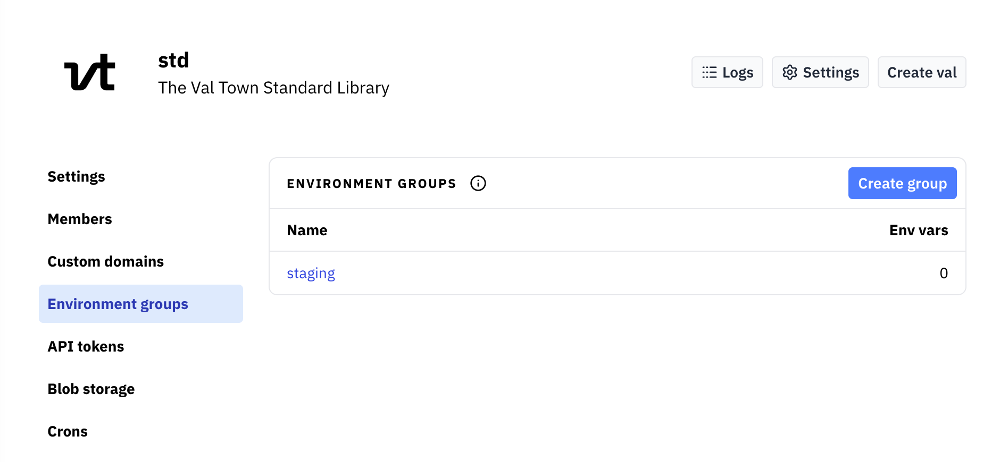

:::note
This feature is only available to organization accounts
:::

When you set [environment variables](/reference/environment-variables) in a val, they are only available
to that val. Within an organization, you can create **environment variable groups** to
share environment variables between multiple vals.

To use environment groups, go to your organization's settings and to the **Environment groups**
menu item. Name a group, and add some environment variables to it.

Then, for any val in your organization, you can go to that val's **Environment variables** settings
and at the bottom of the page, link the environment group to that val. This will include all of
the variables from the environment variable group whenever the val runs.
