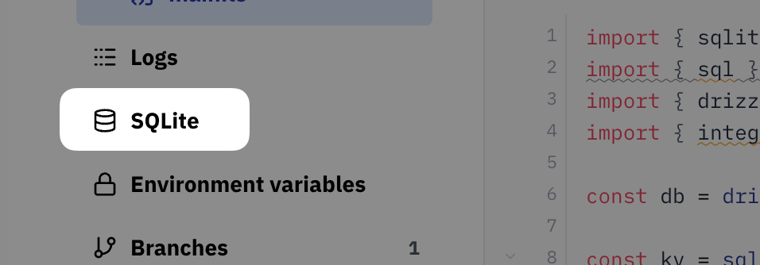
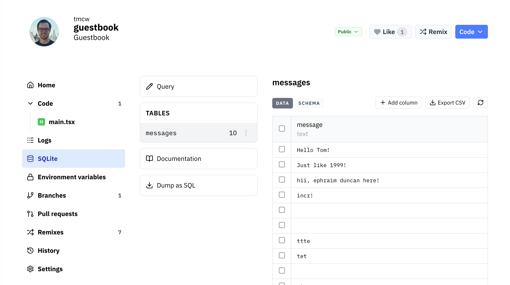

There's a built-in administration panel for every val's SQLite database, available via the navigation on the left side:

The administration interface lets you

- Run arbitrary SQL queries
- View, rename, and delete database tables, columns, and data
- Export a table as CSV
- Dump the database as SQL
- Copy a table's schema

#### SQLite Admin Panels

You can also use third-party tools to administer your database:

- [Outerbase Studio](https://libsqlstudio.com/) **(recommended)** - formerly LibSQL Studio – see [instructions](https://libsqlstudio.com/docs/connect-valtown) (currently only available for the organization-scoped database, not the val-scoped database)
- [SQLite Explorer React](https://www.val.town/x/nbbaier/sqliteExplorerReact) - built in a val - access your database with Val Town oauth
