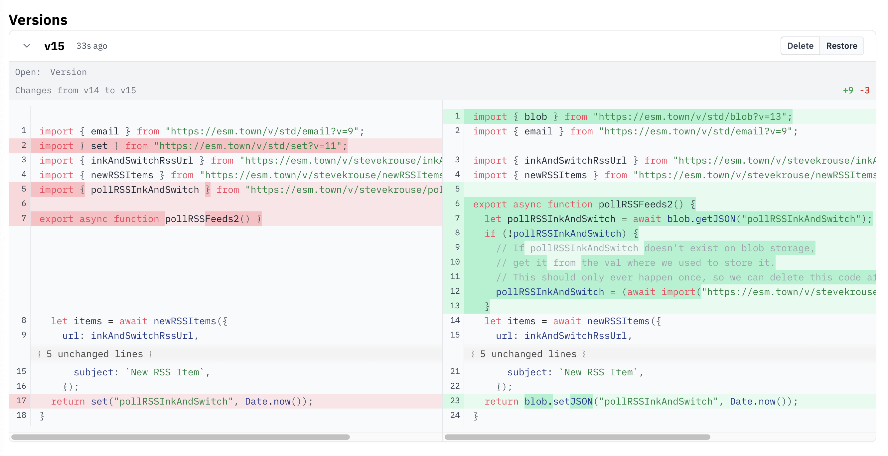

On Nov 1, 2024, [we announced safer default API scopes for vals](https://blog.val.town/blog/api-token-scopes/), which don't include the `val:write` scope. Some users were not included in that upgrade, because we detected it might cause some of their vals to break. We reached out to those users on Jan 10, 2025 to give them a month to upgrade their vals. We removed the `val:write` scope from all those remaining users vals on Feb 11, 2025 unless we heard back from you.

One of the most common uses of the `val:write` permission is the now-deprecated [std.set](https://www.val.town/v/std/set), since it modifies another val. If you're seeing an error with `std/set`, there are two actions you can take, outlined below. 

As always, feel free to reach out in [#general](https://discord.com/channels/1020432421243592714/1020432421243592717) on Discord or [via email](/contact-us/contact-us/) if you have any questions or want to set up a time to pair program.

## Use Blob Storage Instead (recommended)

`Std/set` is deprecated and we now use blob storage with our [`std/blob`](https://www.val.town/v/std/blob) library instead. The equivalent function to `std.set()` is [`blob.setJSON()`](https://www.val.town/v/std/blob#L161). 


```js
// Using std/set
import { set } from "https://esm.town/v/std/set";
set("createdAt", Date.now());
```

```js
// Using std/blob
import { blob } from "https://esm.town/v/std/blob";
blob.setJSON("createdAt", Date.now());
```

Below is a real world example of swapping out `std/set` for `std/blob` in [a cron val](https://www.val.town/v/stevekrouse/pollRSSFeeds2) that polls RSS feeds and emails the results:




If you want to learn more about how to use blob storage, [check out our docs here](https://docs.val.town/std/blob/#_top). You can also view and manually edit your blobs by forking this [blob admin val](https://www.val.town/v/stevekrouse/blob_admin).

## Add Val Write Permissions to Your Val

Alternatively, you can update your val's permission scopes so it can create or modify other vals again. To do this:

### 1. Go to your val's Settings


### 2. Scroll down to the Permissions section and select the Vals dropdown


### 3. Select Read and Write


You're good to go!
