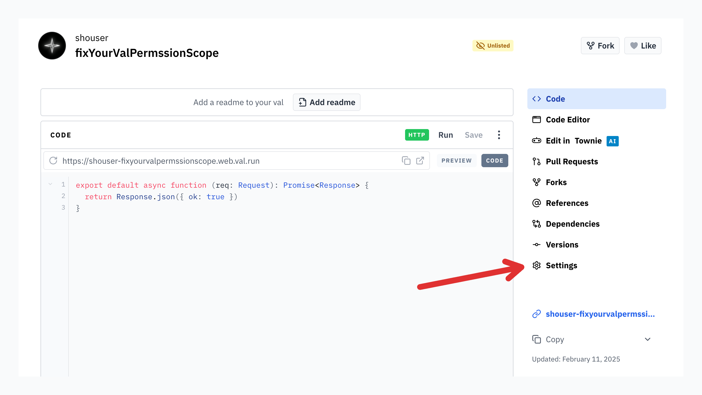
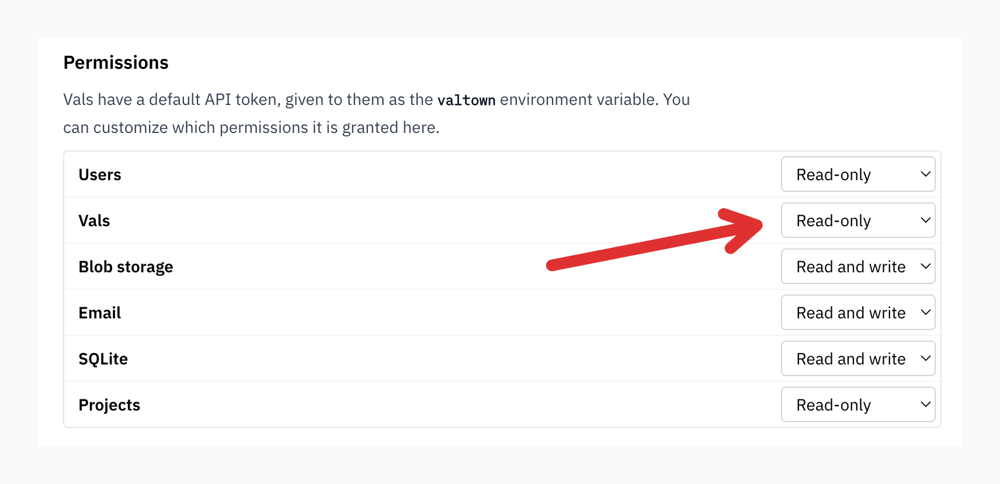
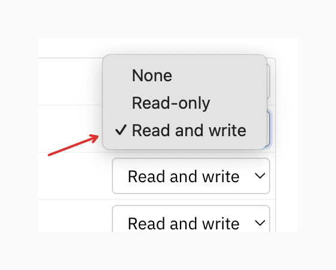

On February 11th, 2025, we finished making improvements to Val Town's security by updating new [granular controls over val permissions](https://blog.val.town/blog/api-token-scopes/) to the `read-only` default. Vals that were previously able to create or modify other vals can now only do so if you explicitly allow them.

The deprecated [std.set](https://www.val.town/v/std/set) function requires any vals using it to have a `val:write` permission, since it modifies another val. If you're seeing this error, there are two actions you can take:

## Use Blob Storage Instead (recommended)

Std/set is deprecated and we now use blob storage instead. You can use the [std/blob](https://www.val.town/v/std/blob) library and learn more [in our docs](https://docs.val.town/std/blob/).

## Add Val Write Permissions to Your Val

Alternatively, you can update your val's permission scopes so it can create or modify other vals again. To do this:

### 1. Go to your val's Settings

### 2. Scroll down to the Permissions section and select the Vals dropdown

### 3. Select Read and Write

You're good to go!