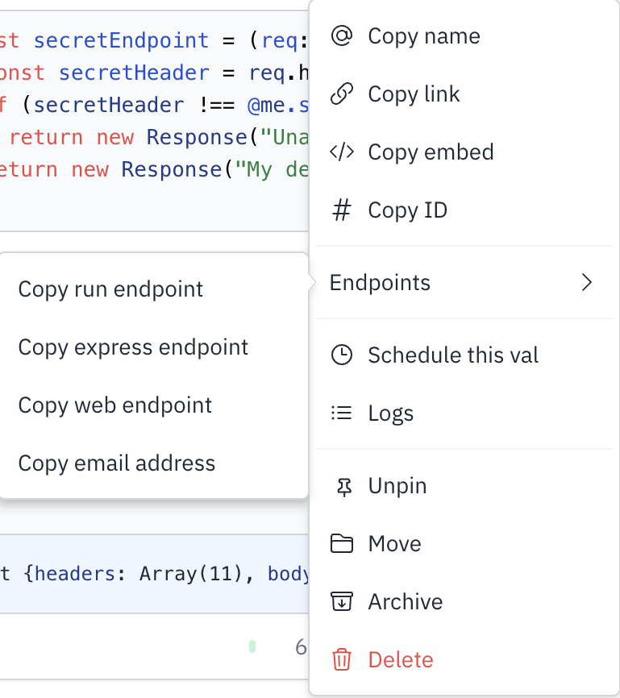

You can trigger a val to run by sending it an email.

An email handler is a function that accepts an email object as its input.

  <iframe src="https://www.val.town/embed/stevekrouse.testEmail2" width="100%" frameborder="no" style="height: 400px;">
    &#x20;
  </iframe>

The email address for
[@stevekrouse.testEmail2](https://www.val.town/v/stevekrouse.testEmail) is
`steverkouse.testEmail2@valtown.email`. Note that the username does not contain
a leading `@` and that the email domain is `valtown.email`. You can copy a val’s
email address from **⋮** > Endpoints > Copy email address.

You can view all the emails sent to this function here:

  <iframe src="https://www.val.town/embed/stevekrouse.testEmails" width="100%" frameborder="no" style="height: 400px;">
    &#x20;
  </iframe>

Test it out yourself by sending an email to
`steverkouse.testEmail2@valtown.email` and your email should show up in this
list above.
