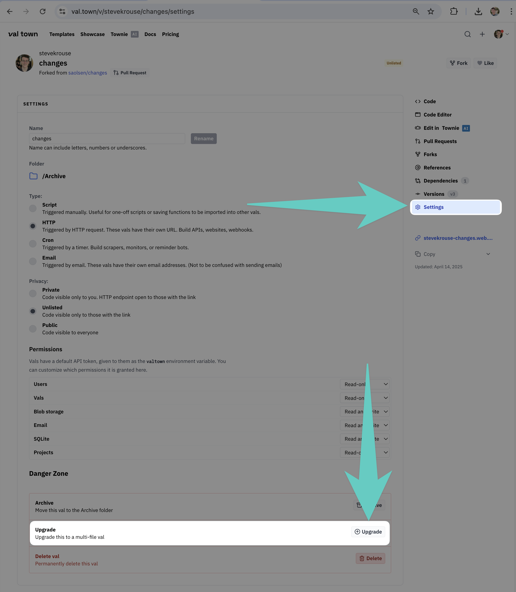

We are unifying _vals_ and _projects_ into a single primitive: the **val** – a collaborative folder of deployed code – that includes all the best features of both.

## Legacy Vals → Projects → Vals & Triggers

The confusing part of this upgrade is that we’re shuffling around some names.

1. _Legacy vals_ will be upgraded to _projects_.
2. After the migration is done, we’ll rename _projects_ to _vals_.
3. We'll rename `HTTP`, `Cron`, and `Email` _val types_ to _triggers_.

Like Val Town Projects, these upgraded vals will be able to contain multiple `HTTP`, `Cron`, and `Email` triggers. The `Script` val type is going away; all JavaScript files will be runnable.

We know this name shuffling is confusing. Thanks for bearing with us!

## How upgrading works

When you upgrade your legacy val, we’ll migrate it to a Val Town Project. This process is fully automated and takes just a few seconds.

### Naming

- Your val becomes a Val Town Project with the same name.
- If you already have a project with that name, we’ll add `_migrated` to the name.

### Code Migration

- Your code moves into a `main.tsx` file.
- Your README becomes the project's `README.md`.
- Version history migrates intact, preserving timestamps.

### Triggers

- All existing HTTP endpoints, crons, email handlers, and custom domains will be preserved.

### Imports

- Imports via `esm.town` will still point to previous versions unless updated manually.
- Relative imports are converted automatically to absolute imports.

### `import.meta.url`

- Common usage of `import.meta.url`, such as `@pomdtr/extractValInfo`, will be upgraded automatically.

### Environment Variables

- Global environment variables automatically transfer (you can disable this in project settings)

### Legacy Val Folders

- Our migration tool doesn't support legacy val folders due to the technical complexity.
- The legacy folder structure will be preserved as a notes at the bottom of your project's `README.md`

Here’s how you can handle folders:

- **Do nothing:** Upgrade vals individually; they remain separate but functional.
- **Manual consolidation:** Upgrade the main val first, then manually copy & paste other vals' code into the new Val Town Project. This typically takes just a few minutes.
- **Bulk automation:** Quickly migrate source files only using our automated tool at [valtoproject.val.run](https://valtoproject.val.run/). This tool only migrates source files; it doesn't do the other upgrade steps listed above.

**Need help?** Pair with our team by [booking time here](https://calendar.app.google/RV7chTwXAbq4DyYcA).

## How to upgrade your legacy vals

1. Go to your legacy val’s **Settings**.
2. Click **Upgrade**.

## **Next steps**

1. Upgrade early and get priority, hands-on support.
2. Questions? Contact us over [email](mailto:help@val.town) or [Discord](http://discord.val.town/).
3. All remaining legacy vals will be migrated on **April 30, 2025**
4. The migration will be complete on **May 1, 2025**

We appreciate your cooperation and patience during this migration!
