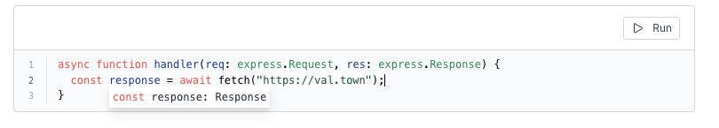
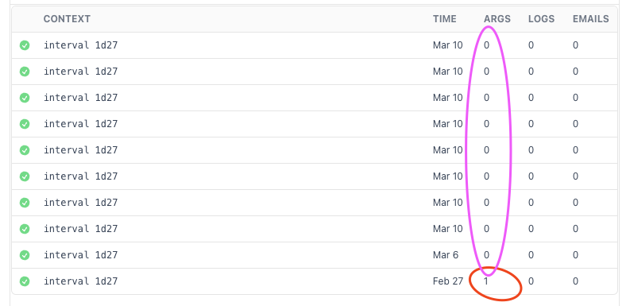

Date: March 14, 2023

Val Town was originally built on a NodeJS runtime. On March 14th, 2023 we cut over to a Deno-based runtime. There are a few breaking changes with the new runtime, enumerated below.

If you find that the new runtime has broken some of your code, we are happy to help you upgrade - just contact us via Discord or email.

# Breaking Changes

## User-defined functions can be synchronous 🥳

In the old runtime, you would need to `await` the call to any `@user.function`. That is no longer the case! Now only async functions are async and synchronous functions don’t need to be awaited!

Happily this works without many changes because if you `await` something that’s not a `Promise` in JavaScript, it simply returns that value. However if you called `.then` on the value returned by another user’s synchronous function, that will no longer work in the new runtime.

## `setInterval` has been removed

Use Scheduled Vals instead.

## `setTimeout` has been removed

Contact us if you need this functionality.

## Promises are not recursively resolved between functions

In the prior runtime, all values were recursively awaited. This means that if you returned an array or object with a Promise nested somewhere inside it, we would’ve resolve that Promise to the underlying value in between all function calls. This is too much magic, and we no longer do it. The main place that this breaking change is felt is when you return an array of promises. Now you need to wrap it with `Promise.all`, like you would in normal JavaScript. We manually went through all instances of this we could find in scheduled vals and upgraded it by hand.

We still unwrap (auto await) promises recursively for you at the very top level of val evaluation.

## Val reference error returns `undefined` instead of throwing

If you referenced `@stevekrouse.valThatDoesntExist` it used to throw a runtime error. Now it returns `undefined`.

## You can’t use `export` without proper variable assignment

You used to be able to write `export a = 1`, but now that will be automatically converted to `export let a = 1`, in order to make it syntactically valid JavaScript.

## ExpressJS types moved to `express` namespace

If you wanted Typescript support for making ExpressJS handler vals, you used to add `Request` and `Response` types to your val’s arguments. However we had to wrap those types in an `express` namespace, so they are now `express.Request` and `express.Response`.

The reason is to make room for the browser-standard `Response` type that is the result of a `fetch` request. The following image shows all three types used in parallel:

## `req.body` is no longer overloaded by `req.query`

In our old runtime, we shoved any `req.query` params into `req.body` in order to try to improve the DX of ExpressJS. We no longer do this because it was too much magic. Now the Express fields behave the way the Express docs say they do.

# Non-breaking changes

## Interval evaluations has `0` arguments where it used to have `1`

On your [intervals page](https://www.val.town/settings/intervals), you may notice that where it used to say that intervals have `1` argument (circled below in red), it now says they take `0` arguments (circled below in purple). This does not affect that fact that intervals pass the `Interval` object to the function that has been scheduled, which allows you to get the `lastRunAt` value of the interval in your schedule vals.

## Untitled val names are generated differently

If you created a val without naming it, we will generate a random untitled name for it slightly differently than before:

`@stevekrouse.untitled5675310` → `@stevekrouse.untitled_uYhSGXfe`

***

Thanks [Tim Reichen](https://github.com/timreichen) for the MIT-licensed Deno artwork at the top!
