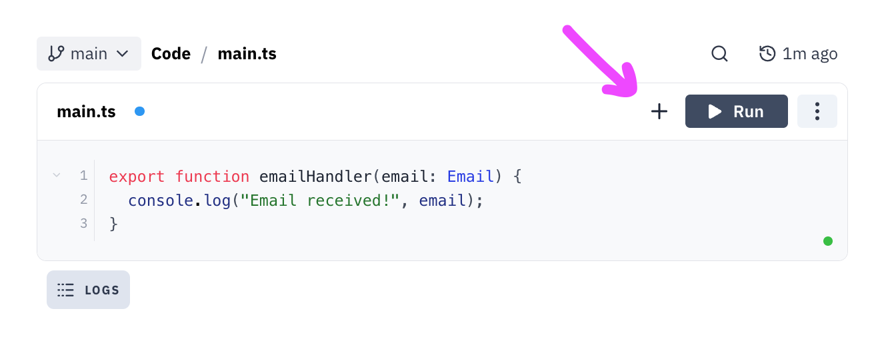
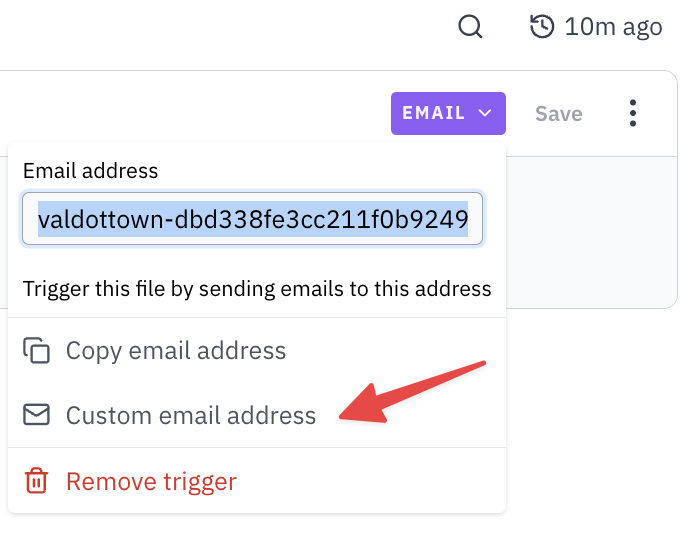

import Val from "@components/Val.astro";

Email triggers provide a unique email address for your val. When Val Town
receives an email at that address, it triggers the corresponding file within the val with the email as its first argument.

Some common examples include:

- Automatically forwarding emails
- Posting support team emails to Discord / Slack

:::tip
Vals can send email, too! Using the [email function in the standard library](/reference/std/email)
:::

To add an email trigger, click the `+` button in the top right of your val editor and select `EMAIL`.



## Type Signature

Files triggered by Email receive an argument called `Email` that represents the email that was sent. Here's an example:

```ts title="Example"
export async function emailValHandler(email: Email) {
  console.log("Email received!", email.from, email.subject, email.text);
  for (const file of email.attachments) {
    console.log(`Filename: ${file.name}`);
    console.log(`Content Type: ${file.type}`);
    console.log(`Content: ${await file.text()}`);
  }
}
```

The `Email` type has this shape:

```ts
interface Email {
  from: string;
  to: string[];
  cc: string | string[] | undefined;
  bcc: string | string[] | undefined;
  subject: string | undefined;
  text: string | undefined;
  html: string | undefined;
  attachments: File[];
}
```

## Example

This Email trigger forwards any email it receives to me. Try it out by sending an email to `stevekrouse.forwarder@valtown.email`.

<Val url="https://www.val.town/embed/x/valdottown/forwarder/forwarder" />

## Custom email address

Similar to [HTTP endpoints](/vals/http/custom-subdomains/), you can set a custom email address by clicking on the `Email` trigger and selecting `Custom email address`.

You can choose any available email address ending in `@valtown.email`.



## Limitations

:::note[Email size limit]

The total size of inbound emails, including attachments, must be less than 30MB.

:::

Email triggers are powered internally by [Sendgrid Inbound Parse](https://www.twilio.com/docs/sendgrid/ui/account-and-settings/inbound-parse).
