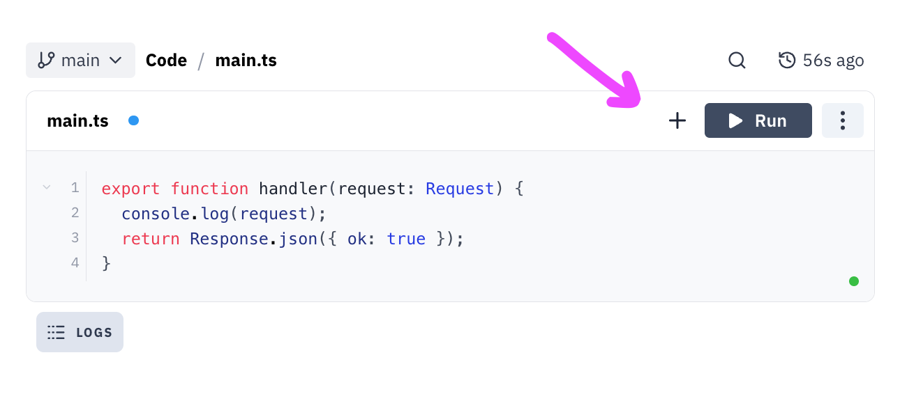

import Val from "@components/Val.astro";
import { LinkCard } from "@astrojs/starlight/components";

HTTP triggers let you serve a scalable API or website.

To add an HTTP trigger, click the `+` button in the top right of your val editor and select `HTTP`.

They are built on the web-standard
[Request](https://developer.mozilla.org/en-US/docs/Web/API/Request) and
[Response](https://developer.mozilla.org/en-US/docs/Web/API/Response) objects,
so are compatible with a number of web frameworks like
[Hono](https://hono.dev/).

<Val
  url="https://www.val.town/embed/x/valdottown/HTTP_examples/HTTP/exampleHTTP"
  height="180px"
/>

<LinkCard title="Basic examples" href="/vals/http/basic-examples" />

<LinkCard title="Routing" href="/vals/http/routing" />

<LinkCard title="Rendering HTML & JSX" href="/vals/http/jsx" />

<LinkCard title="Early-returning responses" href="/vals/http/early-return" />
