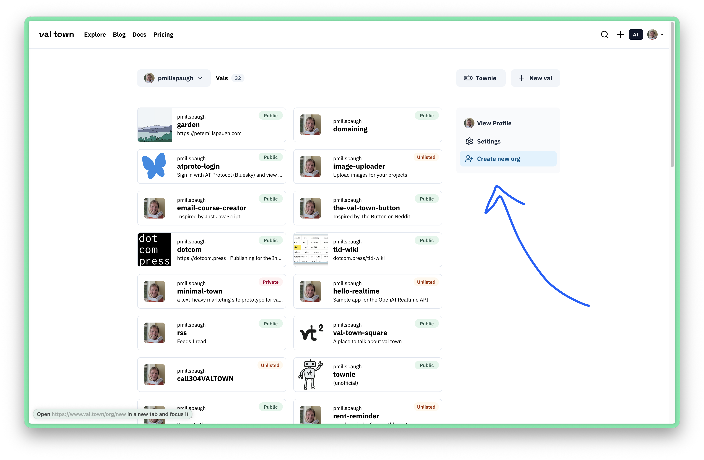

Organizations are how you collaborate with teammates on vals. Creating an org is free, but our [Teams](https://www.val.town/pricing) plan unlocks features, like [environment groups](/reference/environment-groups), higher limits, and hands-on support.

Create a new org from your Val Town [dashboard](https://val.town/dashboard):

