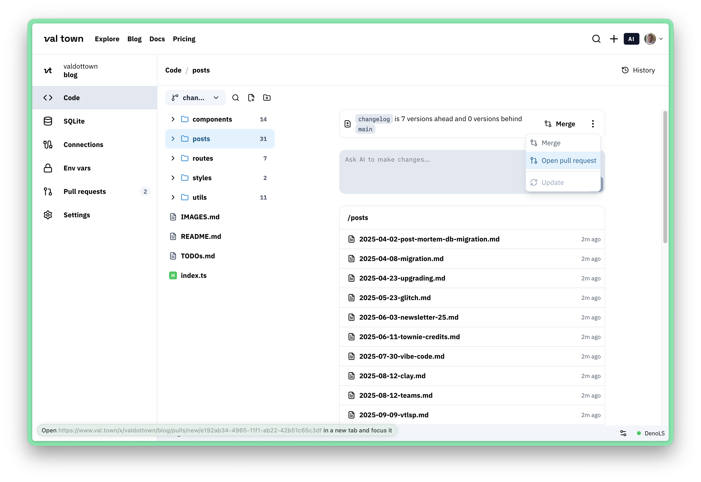

Pull Requests are used to merge changes from a branch or remix back into the parent. Propose changes to a val, and collaborate on vals with your team using PRs.

To make a PR, create a branch off the parent val, then open a pull request when you're ready to review and merge your changes. If you're not the owner of the parent val, you can create a PR from a remix of that val, instead.

